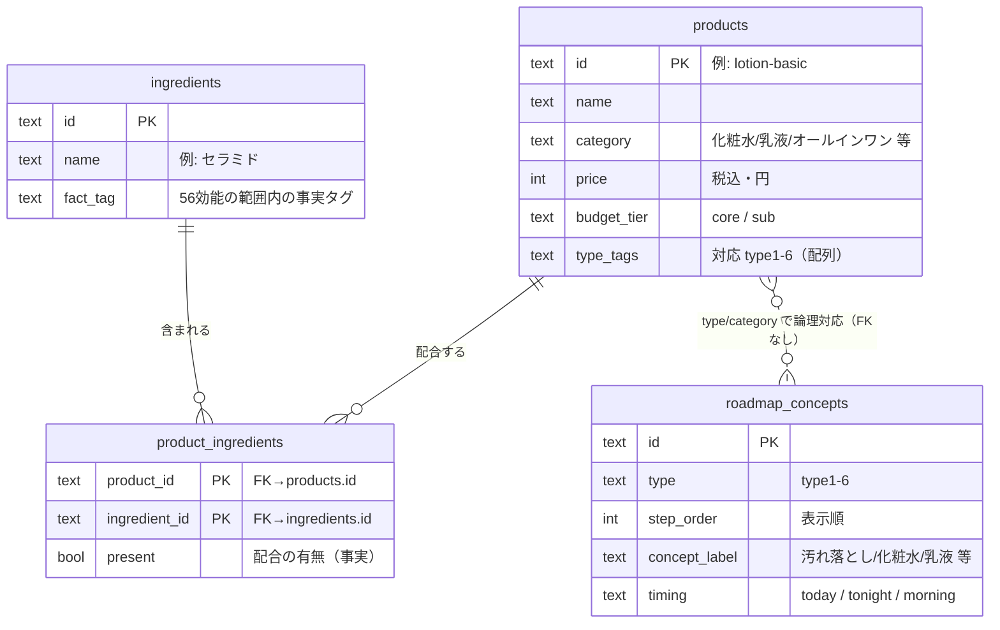

# ER図 v1.0

**プロジェクト：** 田島組 卒業制作（男の身だしなみアプリ）
**親：** [基本設計書 v1.0 §4](../specs/基本設計書_v1.0.md) ／ **正本：** [DB設計書 §2 テーブル定義](./DB設計書_v1.0.md)
**ステータス：** ドラフト（DB設計書 v1.0 に準拠）

> 本書は [DB設計書](./DB設計書_v1.0.md) §1 のER図を独立文書として図式化したもの。
> **列の型・制約の正本は [DB設計書 §2](./DB設計書_v1.0.md) 側**とし、本書はエンティティ関係（多重度・キー）を示す。
> 方針：**マスター（商品・成分）は Supabase に置き読み取り中心。ユーザーデータ（診断回答・記録）は端末ローカルに保存しサーバへ送らない。**

---

## 1. ER図（Supabase：PostgreSQL）

> 図には主要列のみ記載。**全列の定義は [DB設計書 §2](./DB設計書_v1.0.md) を参照**（`brand`・`volume`・`feel`・`scent`・`summary_one_liner`・`image_url`・`created_at` 等）。

---

## 2. エンティティ一覧

| エンティティ | 役割 | 主キー | 保存先 |
| --- | --- | --- | --- |
| `products` | 商品マスター（MVPの中核・30〜50件） | `id` | Supabase |
| `ingredients` | 成分マスター（事実のみ） | `id` | Supabase |
| `product_ingredients` | 商品×成分の「有無」（中間テーブル） | (`product_id`, `ingredient_id`) | Supabase |
| `roadmap_concepts` | タイプ別ロードマップの概念ステップ | `id` | Supabase |

---

## 3. リレーション（多重度）

| 関係 | 左 | 多重度 | 右 | 種別 | 備考 |
| --- | --- | --- | --- | --- | --- |
| 商品⇔成分（多対多） | `products` | 1 — 多 | `product_ingredients` | 実FK（identifying） | 中間テーブルで解決 |
| 成分⇔商品（多対多） | `ingredients` | 1 — 多 | `product_ingredients` | 実FK（identifying） | 中間テーブルで解決 |
| 商品⇔ロードマップ | `products` | 多 — 多 | `roadmap_concepts` | **論理対応（FKなし）** | `type_tags` / `category` で対応。DB上のFK制約は張らない |

- `product_ingredients` は **複合主キー**（`product_id` + `ingredient_id`）。`present`（bool）で配合の有無という事実のみを持つ。
- `roadmap_concepts` は商品と直接のFKを持たず、`type`（`type1`〜`type6`）で診断タイプに紐づく。

---

## 4. 端末ローカル保存（Supabaseには保存しない）

ユーザー由来データはサーバへ送らず、端末に保存する（[DB設計書 §3](./DB設計書_v1.0.md)・[認証・データ保存方針書](../dev/認証・データ保存方針書_v1.0.md) を正本）。RDBのエンティティではないため参考掲載。

| キー | 内容 | 媒体 |
| --- | --- | --- |
| `diagnosis_answers` | 初回チェックの回答 | IndexedDB |
| `diagnosis_result` | `{ primaryType, secondaryType, isComposite, scores, topContributors }` | IndexedDB |
| `continuity_log` | 週次自己評価の履歴 | IndexedDB |
| `prefs` | 文字大きめモード等のUI設定 | localStorage |

> 最小MVP（GitHub Pages・外部API非依存）の段階では、上記ローカル保存を `localStorage` で先行実装している（[#58]）。Supabase 連携はマスターデータのみ・MVP後（ガント `p2b`）。

---

## 5. 改訂履歴

| 日付 | 版 | 変更点 |
| --- | --- | --- |
| 2026-07-07 | v1.0 | 初版。DB設計書 §1 のER図を独立文書化。mermaid `erDiagram`・リレーション/多重度表・ローカル保存の分離を明記。列定義の正本は DB設計書 §2 とした |
