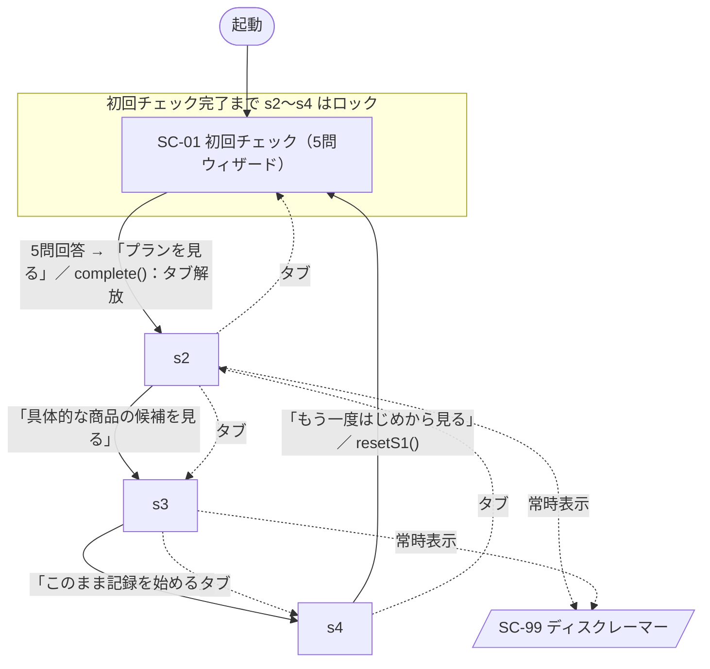
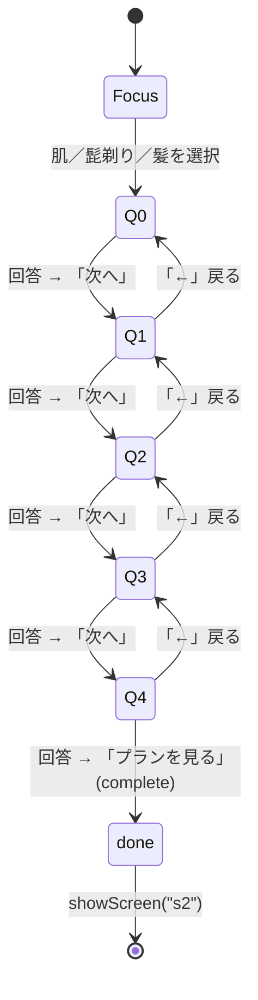

# 画面遷移図 v1.0

**プロジェクト：** 田島組 卒業制作（男の身だしなみアプリ）
**親：** [基本設計書 v1.0 §3.2](../specs/基本設計書_v1.0.md) ／ **関連：** [画面設計書](./画面設計書_v1.0.md)・[状態管理・ルーティング設計](../dev/状態管理・ルーティング設計_v1.0.md)
**ステータス：** ドラフト（実装 `app/` に準拠）

> MVP は**単一ページ（SPA的）＋共有状態オブジェクト**。4画面（`s1`〜`s4`）を `App.showScreen(id)` で切り替える。ルータライブラリは使わない。
> 本書は**実装済みの最小MVP（4画面・5問）の遷移**を正とし、フルスペック（SC-00 導入・6セクション等）は §4 に将来差分として記す。

---

## 1. 画面一覧

| 画面ID | 実装ID | 名称（`STEP_LABEL`） | 機能要件 | CTA ラベル（`CTA_LABEL`） |
| --- | --- | --- | --- | --- |
| SC-01 | `s1` | 初回チェック | F-01 / REQ-01 | 「次へ」→ 最終問で「プランを見る」 |
| SC-02 | `s2` | ロードマップ | F-02 / REQ-02 | 「具体的な商品の候補を見る」 |
| SC-03 | `s3` | 商品をくらべる | F-03/04/05 / REQ-03/04/05 | 「このまま記録を始める」 |
| SC-04 | `s4` | 継続記録 | F-06 / REQ-06 | 「もう一度はじめから見る」 |
| SC-99 | — | ディスクレーマー（共通） | REQ-05（薬機法） | 表示のみ（`s2`/`s3` 最下部に常時表示） |

---

## 2. 全体遷移図（MVP）

- **ロック解放**：`s1` のカテゴリ選択後、全5問に回答 → `complete()` がタブ（②③④）を解放し `s2` を表示。
- **完了後のタブ移動**：初回チェック完了後は、上部タブから `s1`〜`s4` へ直接移動できる（ロック中タップは toast で案内）。
- **リセット**：`s4` の CTA で `resetS1()`（回答・完了フラグを初期化）してから `s1` へ戻る。

---

## 3. S1 初回チェック（ウィザード内部遷移）

入口カードで「肌／髭剃り／髪」を1つ選び、カテゴリ別の質問カード `q0`〜`q4` を1枚ずつ表示する。`state.focusCategory` が質問セット、`state.qIndex` が表示位置を制御する。

- CTA は未回答時は無効（`disabled`）。回答すると有効になる。
- 「←」ボタンは `q1` 以降で表示（`setBackVisible`）。`q0` では非表示。
- 進捗バーは回答数 / 5 で 0.04〜0.25 を表示（`updateProgress`）。

---

## 4. 遷移表

| From | トリガー | To | 条件・副作用 |
| --- | --- | --- | --- |
| （起動） | ページ読み込み | `s1` / `Focus` | タブ②③④ロック。カテゴリ選択前はCTA無効 |
| `s1` `Focus` | 肌／髭剃り／髪を選択 | `q0` | `state.focusCategory` を保存し、カテゴリ別のQ1〜Q3を描画 |
| `s1` `qN` | 選択肢を選ぶ | 同 `qN` | `answers[qN]` 更新、CTA 有効化、進捗更新 |
| `s1` `qN` | 「次へ」 | `qN+1` | `qN < 4` のとき |
| `s1` `q4` | 「プランを見る」 | `s2` | `complete()`：`completed=true`、タブ解放、`s1` を done 表示 |
| `s1` `qN` | 「←」 | `qN-1` | `qN > 0` のとき |
| `s2` | CTA「具体的な商品の候補を見る」 | `s3` | — |
| `s2` | 「◯◯ってなに？」 | （用語シート） | モーダル表示・Esc/スクリムで閉じる |
| `s3` | CTA「このまま記録を始める」 | `s4` | — |
| `s3` | 予算トグル | 同 `s3` | 候補件数を再計算（`filterProductsByBudget`） |
| `s4` | CTA「もう一度はじめから見る」 | `s1` | `resetS1()`：回答・完了フラグ初期化、タブ再ロック |
| `s2`〜`s4` | 上部タブ | 対象画面 | `completed=true` のときのみ有効 |
| ロック中タブ | タップ | 遷移なし | toast「初回チェック（5問）を終えると開きます」 |

---

## 5. フルスペックとの差分（将来）

実装の最小MVP（4画面・5問）に対し、確定仕様では以下を想定（本図の対象外・将来拡張）。

- **SC-00 導入画面**：起動直後のオンボーディング（[提案-U4 #69]）。現状は `s1` 直開き。
- **SC-01 の6セクション・23問化**：診断ロジック設計書 v1.1 準拠（`feature/sc01-check-ui` / `feature/diagnosis-logic`）。Q3 で「ほぼ剃らない等」→ 髭剃りセクションをスキップする分岐を含む。
- 詳細な確定版の遷移は [基本設計書 §3.2](../specs/基本設計書_v1.0.md) を参照。

---

## 6. 改訂履歴

| 日付 | 版 | 変更点 |
| --- | --- | --- |
| 2026-07-07 | v1.0 | 初版。実装 `app/`（4画面・5問ウィザード・タブ/リセット）に整合した画面遷移図を独立文書化。基本設計書 §3.2 のフルスペック差分を明記 |
