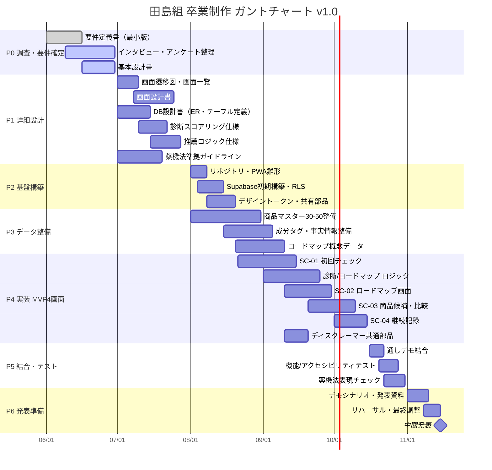

# ガントチャート v1.0

**プロジェクト：** 田島組 卒業制作（男の身だしなみアプリ）
**作成日：** 2026-06-16
**ステータス：** ドラフト（基本設計書 v1.0 に基づく工程計画）
**最大マイルストーン：** 2026年11月 中間発表（MVP 4画面・6機能 動作デモ）
**関連資料：** [要件定義書 v1.0](../specs/要件定義書_v1.0.md)／[基本設計書 v1.0](../specs/基本設計書_v1.0.md)／[機能定義書 v1.0](../specs/機能定義書_v1.0.md)／[診断ロジック設計書 v1.1](../specs/診断ロジック設計書_v1.1.md)／[TODO](../archive/TODO_0529.md)

> 本書は [TODO](../archive/TODO_0529.md) の基本方針「**要件定義 → 設計書 → ガント確定**」に沿い、[基本設計書 v1.0](../specs/基本設計書_v1.0.md) が固まった段階の工程計画です。各タスクの粒度・担当は確定方向ですが、調査結果・実装着手後の実態に応じて見直します。`xlsx` 版（[ガントチャート_v1.0.xlsx](./ガントチャート_v1.0.xlsx)）は本書と同内容で、週単位の色付きタイムライン（ガント）・タスク一覧・概要の3シート構成です。旧 [ガントチャート_（仮）.xlsx](../archive/ガントチャート_（仮）.xlsx) はドラフト版として残置します。

---

## 1. メンバーと役割

| メンバー | 役割 | 主担当（企画書 §8） |
| --- | --- | --- |
| 村上壱基 | リーダー・品質管理者 | 共有コンポーネント・デザイントークン・全体設計・進捗管理 |
| 新田漣（れん） | サブリーダー | フロント（初回チェック・ロードマップUI） |
| 饒波廣翔（ひろと） | 進捗管理者・課題管理者 | Supabase・診断ロジック |
| 仲程天飛（たかと） | 進捗管理者・人員管理者 | データ・コンテンツ（商品マスター・成分タグ・薬機法文言） |
| 田島優人（ゆうと） | 課題管理者・人員管理者 | 商品比較・継続記録の画面 |

---

## 2. フェーズ全体像

| フェーズ | 期間（目安） | 主な成果物 |
| --- | --- | --- |
| **P0 調査・要件確定** | 〜2026-06-30 | 要件定義書（済）・インタビュー結果・基本設計書 |
| **P1 詳細設計** | 2026-07-01〜2026-07-31 | 画面設計書・DB設計書・診断スコアリング仕様・推薦ロジック仕様・薬機法ガイドライン |
| **P2 基盤構築** | 2026-08-01〜2026-08-20 | リポジトリ・PWA雛形・Supabase初期構築・デザイントークン・共有部品 |
| **P3 データ整備** | 2026-08-01〜2026-09-10 | 商品マスター30-50・成分タグ・ロードマップ概念データ |
| **P4 実装（MVP 4画面）** | 2026-08-21〜2026-10-15 | SC-01〜SC-04・診断/推薦ロジック・ディスクレーマー |
| **P5 結合・テスト** | 2026-10-16〜2026-10-31 | 通しデモ・機能/アクセシビリティテスト・薬機法表現チェック |
| **P6 中間発表準備** | 2026-11-01〜2026-11-15 | デモシナリオ・発表資料・リハーサル |
| **★ 中間発表** | 2026-11 | MVP動作デモ |

---

## 3. タイムライン（Mermaid Gantt）

> Mermaid が表示できない環境では、下記 §4 の表を参照してください。

---

## 4. タスク一覧（担当・依存）

| ID | フェーズ | タスク | 担当 | 開始 | 終了 | 依存 |
| --- | --- | --- | --- | --- | --- | --- |
| p0a | P0 | 要件定義書（最小版）✅ | 村上 | 06/01 | 06/16 | — |
| p0b | P0 | インタビュー・アンケート整理 | たかと/全員 | 06/09 | 06/30 | — |
| p0c | P0 | 基本設計書 | 村上 | 06/16 | 06/30 | p0a |
| p1a | P1 | 画面遷移図・画面一覧 | 村上/れん | 07/01 | 07/10 | p0c |
| p1b | P1 | 画面設計書（各画面） | れん/ゆうと | 07/08 | 07/25 | p1a |
| p1c | P1 | DB設計書（ER・テーブル定義） | ひろと | 07/01 | 07/15 | p0c |
| p1d | P1 | 診断スコアリング仕様 | ひろと | 07/10 | 07/22 | p0c |
| p1e | P1 | 推薦ロジック仕様 | ひろと/たかと | 07/15 | 07/28 | p1c,p1d |
| p1f | P1 | 薬機法準拠ガイドライン | たかと | 07/01 | 07/20 | p0c |
| p2a | P2 | リポジトリ・PWA雛形 | 村上 | 08/01 | 08/08 | p1a |
| p2b | P2 | Supabase初期構築・RLS | ひろと | 08/04 | 08/15 | p1c |
| p2c | P2 | デザイントークン・共有部品 | 村上 | 08/08 | 08/20 | p2a |
| p3a | P3 | 商品マスター30-50整備 | たかと | 08/01 | 08/31 | p1c,p1f |
| p3b | P3 | 成分タグ・事実情報整備 | たかと | 08/15 | 09/05 | p3a,p1f |
| p3c | P3 | ロードマップ概念データ | たかと/ひろと | 08/20 | 09/10 | p1d |
| p4a | P4 | SC-01 初回チェック | れん | 08/21 | 09/15 | p1b,p2c |
| p4b | P4 | 診断/ロードマップ ロジック | ひろと | 09/01 | 09/25 | p1d,p2b |
| p4c | P4 | SC-02 ロードマップ画面 | れん | 09/10 | 09/30 | p4b,p3c |
| p4d | P4 | SC-03 商品候補・比較 | ゆうと | 09/20 | 10/10 | p1e,p3b |
| p4e | P4 | SC-04 継続記録 | ゆうと | 10/01 | 10/15 | p2c |
| p4f | P4 | ディスクレーマー共通部品 | 村上 | 09/10 | 09/20 | p1f |
| p5a | P5 | 通しデモ結合 | 全員 | 10/16 | 10/22 | p4a-p4f |
| p5b | P5 | 機能/アクセシビリティテスト | 村上/全員 | 10/20 | 10/28 | p5a |
| p5c | P5 | 薬機法表現チェック | たかと | 10/22 | 10/31 | p5a |
| p6a | P6 | デモシナリオ・発表資料 | 全員 | 11/01 | 11/10 | p5b,p5c |
| p6b | P6 | リハーサル・最終調整 | 全員 | 11/08 | 11/15 | p6a |

> 日付は2026年。`✅` は完了済み。

---

## 5. マイルストーン

| マイルストーン | 期日 | 達成条件 |
| --- | --- | --- |
| **M0 要件・基本設計 確定** | 2026-06-30 | 要件定義書・基本設計書がレビュー済み |
| **M1 詳細設計 完了** | 2026-07-31 | 画面/DB/診断/推薦/薬機法の各仕様が揃う |
| **M2 基盤・データ 準備完了** | 2026-09-10 | PWA雛形・Supabase・商品30-50・成分タグが揃う |
| **M3 MVP実装 完了** | 2026-10-15 | SC-01〜SC-04が個別に動作 |
| **M4 通しデモ 成立** | 2026-10-31 | 初回チェック→ロードマップ表示まで止まらず動く（成功条件） |
| **★ 中間発表** | 2026-11 | MVP 4画面の動作デモ・発表 |

---

## 6. リスクと前提

| リスク／前提 | 内容 | 対応 |
| --- | --- | --- |
| 商品データ整備の遅延 | 30-50商品＋成分タグの手動整備が重い | P3を8月初旬から先行着手・たかと専任化 |
| 薬機法表現の手戻り | 文言修正が実装後に発生 | P1で薬機法ガイドラインを先に確定（p1f） |
| 診断ロジックの複雑化 | 複合タイプ等で実装が膨らむ | 純粋関数で分離・診断ロジック設計書 v1.1 を凍結基準に |
| 学校行事・他科目との競合 | 稼働が読みにくい | 通しデモ（M4）を10月末に置き発表前にバッファ確保 |
| 外部API前提化 | デモ不安定要因 | MVPは外部API非依存（確認済みデータ）を厳守 |

---

## 7. 改訂履歴

| 日付 | 版 | 主な変更点 |
| --- | --- | --- |
| 2026/06/16 | v1.0 | 初版作成。基本設計書 v1.0 に基づき、P0〜P6の6フェーズ・タスク一覧・依存・マイルストーン・リスクを定義。中間発表（2026-11）を最大マイルストーンに設定 |

---

作成チーム：田島組 ／ 沖縄みらいAI&IT専門学校 卒業制作
ガントチャート v1.0 / 2026年6月16日
