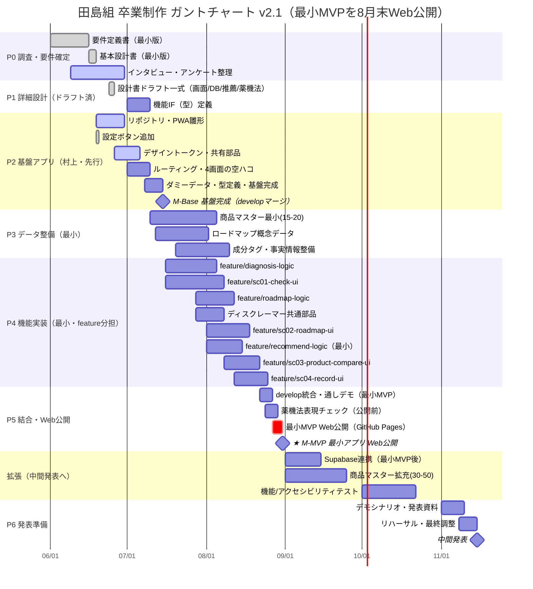

# ガントチャート v2.1

**プロジェクト：** 田島組 卒業制作（男の身だしなみアプリ）
**作成日：** 2026-06-19（最終更新：2026-06-26 / v2.1）
**ステータス：** ドラフト（基盤アプリ先行 → 最小MVPを8月末Web公開）
**主目標（近期）：** ★ **2026-08-31 までに最小機能アプリをWeb上で動作公開（M-MVP）**
**最大マイルストーン：** 2026年11月 中間発表（拡張版MVP 動作デモ）
**関連資料：** [要件定義書 v1.0](../specs/要件定義書_v1.0.md)／[基本設計書 v1.0](../specs/基本設計書_v1.0.md)／[機能定義書 v1.0](../specs/機能定義書_v1.0.md)／[診断ロジック設計書 v1.1](../specs/診断ロジック設計書_v1.1.md)／詳細設計：[`design/`](../design/)・[`guidelines/`](../guidelines/)・[`dev/`](../dev/)／[TODO](../archive/TODO_0529.md)

> **v2.1 の主な変更点：** 近期の主目標を「**8月末までに最小機能アプリをWeb上で動作公開（M-MVP）**」に設定。これに合わせて、基盤アプリ完成（M-Base）を **7/15 に前倒し**、P3（最小データ）・P4（最小機能）を **7〜8月に圧縮**、**最小MVP Web公開タスク（GitHub Pages）** を追加した。Supabase連携・商品データ拡充(30-50)・本格テストは **9〜10月**、中間発表準備は11月。MVPの中身（4画面・6機能）は v1.0 から不変で、**まずローカルデータで動く最小版を8月末に出す**方針。`xlsx`（[ガントチャート_v2.0.xlsx](./ガントチャート_v2.0.xlsx)）は日別（1日1列）で本書と同内容。※ファイル名は互換のため `v2.0` のまま、内容バージョンは v2.1。

> **進捗メモ（2026-06-26）：** P1 詳細設計のドキュメント（[画面設計書](../design/画面設計書_v1.0.md)・[DB設計書](../design/DB設計書_v1.0.md)・[推薦ロジック仕様書](../design/推薦ロジック仕様書_v1.0.md)・[商品マスタ設計書](../design/商品マスタ設計書_v1.0.md)・[薬機法準拠ガイドライン](../guidelines/薬機法準拠ガイドライン_v1.0.md) ほか）を前倒しでドラフト作成済み。技術スタックは **MVP＝バニラJS（ビルドなし）→ 完成後・任意でReact移行**（[基本設計書 §2.4](../specs/基本設計書_v1.0.md)）。

---

## 1. メンバーと役割

| メンバー | 役割 | 主担当（feature 分担） |
| --- | --- | --- |
| 村上壱基 | リーダー・品質管理者 | **基盤アプリ構築**・共有部品・デザイントークン・**Web公開**・進捗管理・マージ/レビュー（基盤/共有は都度ブランチで対応） |
| 新田漣（れん） | サブリーダー | `feature/sc01-check-ui`・`feature/sc02-roadmap-ui` |
| 饒波廣翔（ひろと） | 進捗管理者・課題管理者 | `feature/diagnosis-logic`・`feature/roadmap-logic`・Supabase連携 |
| 仲程天飛（たかと） | 進捗管理者・人員管理者 | データ・コンテンツ（商品マスター・成分タグ・薬機法文言）・`feature/recommend-logic` |
| 田島優人（ゆうと） | 課題管理者・人員管理者 | `feature/sc03-product-compare-ui`・`feature/sc04-record-ui` |

> **分担単位は「機能/ロジック単位」**。UI（SC-xx）とロジック（純粋関数）を別 feature に分け、村上が作る基盤アプリのインターフェース（型・ダミーデータ・空ハコ画面）に対して実装する。

---

## 2. ブランチ戦略

```
main（保護）
  └─ develop（統合先）
       ├─ 基盤アプリ（村上が先行構築 → develop にマージ：M-Base 7/15）
       │
       ├─ feature/settings-button          （村上・済）
       ├─ feature/sc01-check-ui            （れん）
       ├─ feature/sc02-roadmap-ui          （れん）
       ├─ feature/diagnosis-logic          （ひろと）
       ├─ feature/roadmap-logic            （ひろと）
       ├─ feature/recommend-logic          （たかと）
       ├─ feature/sc03-product-compare-ui  （ゆうと）
       └─ feature/sc04-record-ui           （ゆうと）
```

> **注**：上のブランチ一覧は**計画上の分担（代表ブランチ名）**。実際は「1タスク1ブランチ」で都度作成し、**マージ後は削除**する（`feature/settings-button` 等は済＝削除済み）。現在オープンな作業ブランチは GitHub を正とする。`AGENTS.md`/`CLAUDE.md` の `branch_rules` と同じ扱い。

- **前提**：各 feature は「基盤アプリが develop にマージ済み（M-Base 7/15）」を着手条件とする。
- **流れ**：feature 完成 → PR → 村上レビュー → develop にマージ → 各自 develop を取り込み直す。
- 共有ファイル（型定義・デザイントークン・共有部品）は基盤側（村上）が一次管理。

---

## 3. フェーズ全体像

| フェーズ | 期間（目安） | 主な成果物 |
| --- | --- | --- |
| **P0 調査・要件確定** | 〜2026-06-30 | 要件定義書（済）・インタビュー結果・基本設計書（済） |
| **P1 詳細設計（ドラフト済→確定）** | 2026-06-24〜2026-07-10 | 画面/DB/診断・推薦/薬機法の各設計（ドラフト済）・**機能IF（型）定義** |
| **P2 基盤アプリ構築（村上・先行）** | 2026-06-19〜2026-07-15 | リポジトリ・PWA雛形・設定ボタン・デザイントークン・共有部品・ルーティング・4画面の空ハコ・ダミーデータ・型定義（**M-Base 7/15**）／Supabase連携は最小MVP後 |
| **P3 データ整備（最小→拡充）** | 2026-07-10〜2026-09-25 | 商品マスター最小(15-20)→拡充(30-50)・成分タグ・ロードマップ概念データ |
| **P4 機能実装（最小・feature分担）** | 2026-07-16〜2026-08-25 | 各 feature で SC-01〜04・診断/ロードマップ/推薦(最小)・ディスクレーマー |
| **P5 結合・Web公開／テスト** | 2026-08-22〜2026-10-22 | develop統合・通しデモ・薬機法チェック・**GitHub Pages公開（8/31）**・機能/アクセシビリティテスト |
| **P6 中間発表準備** | 2026-11-01〜2026-11-15 | デモシナリオ・発表資料・リハーサル |
| **★ M-MVP 最小アプリ Web公開** | **2026-08-31** | **4画面がWeb上で動作（ローカルデータ）** |
| **★ 中間発表** | 2026-11 | 拡張版MVP 動作デモ |
| **P7 技術スタック移行（任意）** | 中間発表後・余裕がある場合 | ロジック/データ層を再利用し UI を React+Vite+TS へ段階移行（[基本設計書 §2.4](../specs/基本設計書_v1.0.md)） |

> **最小MVPのスコープ（8/31 時点）**：4画面（初回チェック→ロードマップ→商品候補/比較→継続記録）が **ローカルデータ**で通しで動き、**GitHub Pages 上で公開**されている状態。Supabase連携・商品30-50・本格テストは8月末時点では必須としない（9〜10月で拡充）。

---

## 4. タイムライン（Mermaid Gantt）



> Mermaid が表示できない環境では、下記 §5 の表を参照してください。

---

## 5. タスク一覧（担当・ブランチ・依存）

| ID | フェーズ | タスク | 担当 | ブランチ | 開始 | 終了 | 依存 |
| --- | --- | --- | --- | --- | --- | --- | --- |
| p0a | P0 | 要件定義書（最小版）✅ | 村上 | — | 06/01 | 06/16 | — |
| p0c | P0 | 基本設計書（最小版）✅ | 村上 | — | 06/16 | 06/19 | p0a |
| p0b | P0 | インタビュー・アンケート整理 | たかと/全員 | — | 06/09 | 06/30 | — |
| p1b | P1 | 画面設計書（ドラフト済）✅ | れん/ゆうと | — | 06/24 | 06/26 | p0c |
| p1c | P1 | DB設計書（ドラフト済）✅ | ひろと | — | 06/24 | 06/26 | p0c |
| p1d | P1 | 診断/推薦ロジック仕様（ドラフト済）✅ | ひろと/たかと | — | 06/24 | 06/26 | p0c |
| p1f | P1 | 薬機法準拠ガイドライン（ドラフト済）✅ | たかと | — | 06/24 | 06/26 | p0c |
| p1g | P1 | 機能IF（型）定義 | 村上 | 基盤 | 07/01 | 07/10 | p1b,p1c,p1d |
| **p2a** | **P2** | **リポジトリ・PWA雛形** | **村上** | **基盤** | 06/19 | 06/30 | p0c |
| **p2s** | **P2** | **設定ボタン追加 ✅** | **村上** | **feature/settings-button** | 06/19 | 06/19 | p2a |
| **p2c** | **P2** | **デザイントークン・共有部品** | **村上** | **基盤** | 06/26 | 07/06 | p2a |
| **p2d** | **P2** | **ルーティング・4画面の空ハコ** | **村上** | **基盤** | 07/01 | 07/10 | p2a |
| **p2e** | **P2** | **ダミーデータ・型定義・基盤完成→developマージ** | **村上** | **基盤** | 07/08 | 07/15 | p2c,p2d,p1g |
| **★mbase** | **M** | **★ M-Base 基盤アプリ完成（developマージ）** | **村上** | **基盤** | 07/15 | 07/15 | p2e |
| p3a | P3 | 商品マスター 最小整備(15-20) | たかと | — | 07/10 | 08/05 | p1c,p1f |
| p3c | P3 | ロードマップ概念データ | たかと/ひろと | — | 07/12 | 08/02 | p1d |
| p3b | P3 | 成分タグ・事実情報整備 | たかと | — | 07/20 | 08/10 | p3a,p1f |
| p4b | P4 | 診断ロジック（純粋関数） | ひろと | feature/diagnosis-logic | 07/16 | 08/05 | mbase,p1d |
| p4a | P4 | SC-01 初回チェックUI | れん | feature/sc01-check-ui | 07/16 | 08/08 | mbase,p1b |
| p4g | P4 | ロードマップ生成ロジック | ひろと | feature/roadmap-logic | 07/28 | 08/12 | p4b,p3c |
| p4f | P4 | ディスクレーマー共通部品 | 村上 | 基盤/feature | 07/28 | 08/08 | p1f |
| p4c | P4 | SC-02 ロードマップUI | れん | feature/sc02-roadmap-ui | 08/01 | 08/18 | p4g,mbase |
| p4h | P4 | 推薦ロジック（最小・純粋関数） | たかと | feature/recommend-logic | 08/01 | 08/15 | p3a,p1d |
| p4d | P4 | SC-03 商品比較UI | ゆうと | feature/sc03-product-compare-ui | 08/08 | 08/22 | p4h,p3a,mbase |
| p4e | P4 | SC-04 継続記録UI | ゆうと | feature/sc04-record-ui | 08/12 | 08/25 | mbase |
| p5a | P5 | develop統合・通しデモ（最小MVP） | 全員 | develop | 08/22 | 08/27 | p4a,p4b,p4c,p4d,p4e |
| p5c | P5 | 薬機法表現チェック（公開前） | たかと | develop | 08/24 | 08/29 | p5a |
| **p5d** | **P5** | **最小MVP Web公開（GitHub Pages）** | **村上** | **develop** | 08/27 | 08/31 | p5a,p5c |
| **★mmvp** | **M** | **★ M-MVP 最小アプリ Web公開（8月末・WEB動作）** | **全員** | **—** | 08/31 | 08/31 | p5d |
| p2b | P2 | Supabase連携（最小MVP後・拡張） | 村上/ひろと | 基盤 | 09/01 | 09/15 | p2e |
| p3d | P3 | 商品マスター拡充(30-50) | たかと | — | 09/01 | 09/25 | p3a |
| p5b | P5 | 機能/アクセシビリティテスト | 村上/全員 | develop | 10/01 | 10/22 | p5d,p3d |
| p6a | P6 | デモシナリオ・発表資料 | 全員 | — | 11/01 | 11/10 | p5b |
| p6b | P6 | リハーサル・最終調整 | 全員 | — | 11/08 | 11/15 | p6a |
| ★m1 | M | ★ 中間発表（マイルストーン） | 全員 | — | 11/15 | 11/15 | p6b |

> 日付は2026年。`✅` は完了済み。**太字（P2）は村上が先行する基盤アプリ構築タスク**。`mbase`（7/15）が各 feature の共通着手前提、`p5d`（最小MVP Web公開）が **8月末の主目標 M-MVP** のクリティカルタスク。

---

## 6. マイルストーン

| マイルストーン | 期日 | 達成条件 |
| --- | --- | --- |
| **M0 要件・基本設計 確定** | 2026-06-30 | 要件定義書・基本設計書がレビュー済み |
| **★ M-Base 基盤アプリ完成** | 2026-07-15 | PWA雛形・共有部品・ルーティング・4画面の空ハコ・ダミーデータ・型が **develop にマージ** され、各メンバーが feature 着手できる |
| **★ M-MVP 最小アプリ Web公開（主目標）** | **2026-08-31** | 4画面（初回チェック→ロードマップ→商品候補/比較→継続記録）が**ローカルデータで通しで動作**し、**GitHub Pages 上で公開**されている |
| **M2 拡張完了** | 2026-09-25 | Supabase連携・商品データ拡充(30-50)が反映される |
| **M3 テスト完了** | 2026-10-22 | 機能/アクセシビリティ/薬機法表現の確認が完了 |
| **★ 中間発表** | 2026-11 | 拡張版MVPの動作デモ・発表 |

---

## 7. リスクと前提

| リスク／前提 | 内容 | 対応 |
| --- | --- | --- |
| **8月末（M-MVP）が短期で過密** | 基盤7/15完成後、約6週間で4画面を実装・公開する必要がある | スコープを**最小（ローカルデータ・必須4画面のみ）**に厳格化。Supabase・データ拡充・本格テストは9月以降へ後ろ倒し |
| **基盤アプリの遅延がボトルネック化** | 基盤（M-Base 7/15）が遅れると全 feature が着手できない | 村上が先行・7/15完了を最優先。型/ダミーデータを早期確定し feature を待たせない |
| **基盤IFの後出し変更** | 型・共有部品の変更が feature 全体に波及 | P1で機能IF（型）を確定（p1g）。IF凍結、変更は村上一次管理 |
| 商品データ整備の遅延 | 手動整備が重い | 8月末は**最小15-20件**で成立させ、30-50件への拡充は9月（p3d） |
| 薬機法表現の手戻り | 公開後の文言修正はリスク | **公開前チェック（p5c）を8月末の必須ゲート**に。設計段階のガイドラインを凍結基準に |
| feature マージ衝突 | 同時マージで競合 | 1機能=1feature で疎結合化・村上がレビュー/マージ集約・こまめに develop 取り込み |
| 学校行事・他科目との競合 | 稼働が読みにくい | 最小MVP（8月末）を先に確定させ、以降は拡張で調整可能にする |
| 外部API前提化 | デモ不安定要因 | MVPは外部API非依存（ローカルの確認済みデータ）を厳守 |

---

## 8. 改訂履歴

| 日付 | 版 | 主な変更点 |
| --- | --- | --- |
| 2026/06/16 | v1.0 | 初版作成。基本設計書 v1.0 に基づき、P0〜P6の6フェーズ・タスク一覧・依存・マイルストーン・リスクを定義 |
| 2026/06/19 | v2.0 | **進め方を「基盤アプリ先行→feature分担」方式に変更。** P2を村上の先行基盤構築に前倒し、P4を feature 分担に再編。ブランチ戦略・機能IF（型）定義・M-Base を追加。`xlsx` を日別表示に変更 |
| 2026/06/26 | **v2.1** | **近期の主目標を「8月末までに最小機能アプリをWeb公開（M-MVP 8/31）」に設定。** 基盤完成を 7/15 に前倒し、P3最小データ・P4最小機能を7〜8月に圧縮、最小MVP Web公開（p5d / GitHub Pages）を追加。Supabase連携・商品データ拡充(30-50)・本格テストは9〜10月へ後ろ倒し。P1設計書のドラフト前倒し完了を反映。ファイル名は互換のため `v2.0` のまま |

---

作成チーム：田島組 ／ 沖縄みらいAI&IT専門学校 卒業制作
ガントチャート v2.1 / 2026年6月26日
