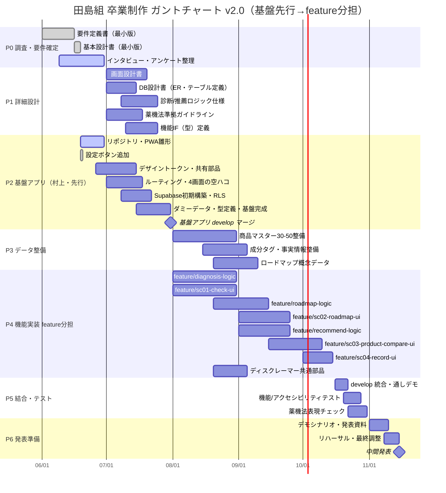

# ガントチャート v2.0

**プロジェクト：** 田島組 卒業制作（男の身だしなみアプリ）
**作成日：** 2026-06-19
**ステータス：** ドラフト（基盤アプリ先行 → feature分担 方式に基づく工程計画）
**最大マイルストーン：** 2026年11月 中間発表（MVP 4画面・6機能 動作デモ）
**関連資料：** [要件定義書 v1.0](../specs/要件定義書_v1.0.md)／[基本設計書 v1.0](../specs/基本設計書_v1.0.md)／[機能定義書 v1.0](../specs/機能定義書_v1.0.md)／[診断ロジック設計書 v1.1](../specs/診断ロジック設計書_v1.1.md)／詳細設計：[`design/`](../design/)・[`guidelines/`](../guidelines/)・[`dev/`](../dev/)／[TODO](../archive/TODO_0529.md)

> **v2.0 の主な変更点：** 進め方を「**まず村上が基盤アプリ（ベース）を作り、そこから各機能を feature ブランチでメンバーに分担して追加していく**」方式へ変更。これに伴いフェーズを **P2 基盤アプリ構築（村上）→ P4 機能実装（feature 分担）** の前後関係で再編した。要件定義書 v1.0・基本設計書 v1.0 の **MVP 4画面・6機能（最小機能）はそのまま変更なし**。`xlsx` 版（[ガントチャート_v2.0.xlsx](./ガントチャート_v2.0.xlsx)）は、横軸を 2026/06/01〜2026/11/15 の **日別（1日1列）** で表示する。旧 [ガントチャート_v1.0](./ガントチャート_v1.0.md)／[（仮）版](../archive/ガントチャート_（仮）.xlsx) はドラフト版として残置する。

> **進捗メモ（2026-06-26）：** P1 詳細設計の各ドキュメント（[画面設計書](../design/画面設計書_v1.0.md)・[DB設計書](../design/DB設計書_v1.0.md)・[推薦ロジック仕様書](../design/推薦ロジック仕様書_v1.0.md)・[商品マスタ設計書](../design/商品マスタ設計書_v1.0.md)・[薬機法準拠ガイドライン](../guidelines/薬機法準拠ガイドライン_v1.0.md) ほか）を**前倒しでドラフト作成済み**（7月のP1はレビュー・確定が主作業に）。あわせて**技術スタック方針を確定**：MVPは **HTML/CSS/バニラJS（ビルドなし）** で完成させ、React 等への移行は **MVP完成後・時間に余裕があれば**行う任意ステップとする（[基本設計書 §2.4](../specs/基本設計書_v1.0.md)）。これに伴い**任意フェーズ P7 を追加**（中間発表後）。

---

## 1. メンバーと役割

| メンバー | 役割 | 主担当（v2.0 の feature 分担） |
| --- | --- | --- |
| 村上壱基 | リーダー・品質管理者 | **基盤アプリ（ベース）構築**・`feature/settings-button`・共有コンポーネント・デザイントークン・全体設計・進捗管理・マージ/レビュー |
| 新田漣（れん） | サブリーダー | `feature/sc01-check-ui`・`feature/sc02-roadmap-ui` |
| 饒波廣翔（ひろと） | 進捗管理者・課題管理者 | `feature/diagnosis-logic`・`feature/roadmap-logic`・Supabase連携 |
| 仲程天飛（たかと） | 進捗管理者・人員管理者 | データ・コンテンツ（商品マスター・成分タグ・薬機法文言）・`feature/recommend-logic` |
| 田島優人（ゆうと） | 課題管理者・人員管理者 | `feature/sc03-product-compare-ui`・`feature/sc04-record-ui` |

> **分担単位は「機能/ロジック単位」**。画面UI（SC-xx）と 診断/推薦などのロジック（純粋関数）を別 feature に分け、UI とロジックを並行で進められるようにする。各 feature は村上が作る基盤アプリのインターフェース（型・ダミーデータ・空ハコ画面）に対して実装する。

---

## 2. ブランチ戦略（v2.0 で新設）

```
main（保護）
  └─ develop（統合先）
       ├─ 基盤アプリ（村上が先行構築 → develop にマージ）
       │
       ├─ feature/settings-button          （村上）
       ├─ feature/sc01-check-ui            （れん）
       ├─ feature/sc02-roadmap-ui          （れん）
       ├─ feature/diagnosis-logic          （ひろと）
       ├─ feature/roadmap-logic            （ひろと）
       ├─ feature/recommend-logic          （たかと）
       ├─ feature/sc03-product-compare-ui  （ゆうと）
       └─ feature/sc04-record-ui           （ゆうと）
```

- **前提**：各 feature は「基盤アプリが develop にマージ済み」を着手条件とする（§5 依存参照）。
- **流れ**：feature 完成 → PR → 村上レビュー → develop にマージ → 各自 develop を取り込み直す。
- **共有ファイル**（型定義・デザイントークン・共有部品）は基盤側（村上）が一次管理。feature 側は変更要望を出す。

---

## 3. フェーズ全体像

| フェーズ | 期間（目安） | 主な成果物 |
| --- | --- | --- |
| **P0 調査・要件確定** | 〜2026-06-30 | 要件定義書（済）・インタビュー結果・基本設計書（済） |
| **P1 詳細設計** | 2026-07-01〜2026-07-31 | 画面設計書・DB設計書・診断/推薦ロジック仕様・薬機法ガイドライン・**機能IF（型）定義**（※各仕様は 06-26 にドラフト作成済み。7月はレビュー・確定が中心） |
| **P2 基盤アプリ構築（村上・先行）** | 2026-06-19〜2026-07-31 | リポジトリ・PWA雛形・設定ボタン・Supabase初期・デザイントークン・共有部品・ルーティング・4画面の空ハコ・ダミーデータ・型定義 |
| **P3 データ整備** | 2026-08-01〜2026-09-10 | 商品マスター30-50・成分タグ・ロードマップ概念データ |
| **P4 機能実装（feature 分担）** | 2026-08-01〜2026-10-15 | 各 feature ブランチで SC-01〜04・診断/ロードマップ/推薦ロジック・ディスクレーマー |
| **P5 結合・テスト** | 2026-10-16〜2026-10-31 | develop 統合・通しデモ・機能/アクセシビリティテスト・薬機法表現チェック |
| **P6 中間発表準備** | 2026-11-01〜2026-11-15 | デモシナリオ・発表資料・リハーサル |
| **★ 中間発表** | 2026-11 | MVP動作デモ |
| **P7 技術スタック移行（任意）** | 中間発表後・余裕がある場合 | バニラJS版で確定したロジック/データ層を再利用し、UIを React + Vite + TS へ段階移行（[基本設計書 §2.4](../specs/基本設計書_v1.0.md)）。MVPの動作・デモ安定性を損なわない範囲のみ |

> v1.0 との差分：旧 P2「基盤構築」を **村上の先行タスク（P2）** として 6/19 着手・7月末完了に前倒し。旧 P4「実装」を **feature 分担の P4** として基盤完成後（8月）に開始する構成へ変更。

---

## 4. タイムライン（Mermaid Gantt）



> Mermaid が表示できない環境では、下記 §5 の表を参照してください。

---

## 5. タスク一覧（担当・ブランチ・依存）

| ID | フェーズ | タスク | 担当 | ブランチ | 開始 | 終了 | 依存 |
| --- | --- | --- | --- | --- | --- | --- | --- |
| p0a | P0 | 要件定義書（最小版）✅ | 村上 | — | 06/01 | 06/16 | — |
| p0c | P0 | 基本設計書（最小版）✅ | 村上 | — | 06/16 | 06/19 | p0a |
| p0b | P0 | インタビュー・アンケート整理 | たかと/全員 | — | 06/09 | 06/30 | — |
| p1b | P1 | 画面設計書（各画面） | れん/ゆうと | — | 07/01 | 07/20 | p0c |
| p1c | P1 | DB設計書（ER・テーブル定義） | ひろと | — | 07/01 | 07/15 | p0c |
| p1d | P1 | 診断/推薦ロジック仕様 | ひろと/たかと | — | 07/08 | 07/25 | p0c |
| p1f | P1 | 薬機法準拠ガイドライン | たかと | — | 07/01 | 07/18 | p0c |
| p1g | P1 | 機能IF（型）定義 | 村上 | 基盤 | 07/10 | 07/25 | p1b,p1c,p1d |
| **p2a** | **P2** | **リポジトリ・PWA雛形** | **村上** | **基盤** | 06/19 | 06/30 | p0c |
| **p2s** | **P2** | **設定ボタン追加 ✅** | **村上** | **feature/settings-button** | 06/19 | 06/19 | p2a |
| **p2c** | **P2** | **デザイントークン・共有部品** | **村上** | **基盤** | 06/26 | 07/15 | p2a |
| **p2d** | **P2** | **ルーティング・4画面の空ハコ** | **村上** | **基盤** | 07/01 | 07/18 | p2a |
| **p2b** | **P2** | **Supabase初期構築・RLS** | **村上/ひろと** | **基盤** | 07/08 | 07/22 | p2a,p1c |
| **p2e** | **P2** | **ダミーデータ・型定義・基盤完成→developマージ** | **村上** | **基盤** | 07/15 | 07/31 | p2c,p2d,p2b,p1g |
| p3a | P3 | 商品マスター30-50整備 | たかと | — | 08/01 | 08/31 | p1c,p1f |
| p3b | P3 | 成分タグ・事実情報整備 | たかと | — | 08/15 | 09/05 | p3a,p1f |
| p3c | P3 | ロードマップ概念データ | たかと/ひろと | — | 08/20 | 09/10 | p1d |
| p4b | P4 | 診断ロジック（純粋関数） | ひろと | feature/diagnosis-logic | 08/01 | 08/31 | **p2e**,p1d |
| p4a | P4 | SC-01 初回チェックUI | れん | feature/sc01-check-ui | 08/01 | 08/31 | **p2e**,p1b |
| p4g | P4 | ロードマップ生成ロジック | ひろと | feature/roadmap-logic | 08/20 | 09/15 | p4b,p3c |
| p4c | P4 | SC-02 ロードマップUI | れん | feature/sc02-roadmap-ui | 09/01 | 09/25 | p4g,**p2e** |
| p4h | P4 | 推薦ロジック（純粋関数） | たかと | feature/recommend-logic | 09/01 | 09/25 | p3b,p1d |
| p4d | P4 | SC-03 商品比較UI | ゆうと | feature/sc03-product-compare-ui | 09/15 | 10/10 | p4h,p3b,**p2e** |
| p4e | P4 | SC-04 継続記録UI | ゆうと | feature/sc04-record-ui | 10/01 | 10/15 | **p2e** |
| p4f | P4 | ディスクレーマー共通部品 | 村上 | 基盤/feature | 08/20 | 09/05 | p1f |
| p5a | P5 | develop 統合・通しデモ | 全員 | develop | 10/16 | 10/22 | p4a-p4h |
| p5b | P5 | 機能/アクセシビリティテスト | 村上/全員 | develop | 10/20 | 10/28 | p5a |
| p5c | P5 | 薬機法表現チェック | たかと | develop | 10/22 | 10/31 | p5a |
| p6a | P6 | デモシナリオ・発表資料 | 全員 | — | 11/01 | 11/10 | p5b,p5c |
| p6b | P6 | リハーサル・最終調整 | 全員 | — | 11/08 | 11/15 | p6a |

> 日付は2026年。`✅` は完了済み。**太字（P2）は村上が先行する基盤アプリ構築タスク**。`p2e`（基盤の develop マージ）が、各 feature（p4a〜）の共通の着手前提。

---

## 6. マイルストーン

| マイルストーン | 期日 | 達成条件 |
| --- | --- | --- |
| **M0 要件・基本設計 確定** | 2026-06-30 | 要件定義書・基本設計書がレビュー済み |
| **M1 詳細設計 完了** | 2026-07-31 | 画面/DB/診断・推薦/薬機法/機能IF（型）の各仕様が揃う |
| **★ M-Base 基盤アプリ完成** | 2026-07-31 | PWA雛形・共有部品・ルーティング・4画面の空ハコ・ダミーデータ・型が **develop にマージ** され、各メンバーが feature 着手できる |
| **M2 基盤・データ 準備完了** | 2026-09-10 | 商品30-50・成分タグ・ロードマップ概念データが揃う |
| **M3 機能実装 完了** | 2026-10-15 | 各 feature（SC-01〜04・診断/ロードマップ/推薦）が個別に動作 |
| **M4 通しデモ 成立** | 2026-10-31 | develop 統合で 初回チェック→ロードマップ表示まで止まらず動く（成功条件） |
| **★ 中間発表** | 2026-11 | MVP 4画面の動作デモ・発表 |

---

## 7. リスクと前提

| リスク／前提 | 内容 | 対応 |
| --- | --- | --- |
| **基盤アプリの遅延がボトルネック化** | 基盤（M-Base）が遅れると全 feature が着手できない | 村上が 6/19 から先行着手・7月末完了を最優先。型/ダミーデータを早期確定し feature を待たせない |
| **基盤IFの後出し変更** | 型・共有部品の変更が feature 全体に波及 | P1 で機能IF（型）を確定（p1g）。基盤側でIF凍結、変更は村上一次管理 |
| 商品データ整備の遅延 | 30-50商品＋成分タグの手動整備が重い | P3を8月初旬から先行着手・たかと専任化 |
| 薬機法表現の手戻り | 文言修正が実装後に発生 | P1で薬機法ガイドラインを先に確定（p1f） |
| 診断ロジックの複雑化 | 複合タイプ等で実装が膨らむ | feature/diagnosis として純粋関数で分離・診断ロジック設計書 v1.1 を凍結基準に |
| feature マージ衝突 | 複数 feature の同時マージで競合 | 1機能=1feature で疎結合化・村上がレビュー/マージを集約・こまめに develop 取り込み |
| 学校行事・他科目との競合 | 稼働が読みにくい | 通しデモ（M4）を10月末に置き発表前にバッファ確保 |
| 外部API前提化 | デモ不安定要因 | MVPは外部API非依存（確認済みデータ）を厳守 |

---

## 8. 改訂履歴

| 日付 | 版 | 主な変更点 |
| --- | --- | --- |
| 2026/06/16 | v1.0 | 初版作成。基本設計書 v1.0 に基づき、P0〜P6の6フェーズ・タスク一覧・依存・マイルストーン・リスクを定義 |
| 2026/06/19 | v2.0 | **進め方を「基盤アプリ先行→feature分担」方式に変更。** P2を村上の先行基盤構築（6/19〜7/31）に前倒し、P4を feature 分担（基盤完成後）に再編。ブランチ戦略（§2）・機能IF（型）定義・M-Base マイルストーンを追加。MVP 4画面・6機能（最小機能）は v1.0 から不変 |
| 2026/06/19 | v2.0追記 | `feature/settings-button` の完了を P2 タスクに追加。feature ブランチ名をリポジトリの命名制約に合わせて ASCII/kebab-case に統一。`xlsx` 版の横軸を週単位から日単位（1日1列）に変更 |
| 2026/06/26 | v2.0追記 | P1 詳細設計ドキュメントを前倒しでドラフト作成済みと明記（`design/`・`guidelines/`・`dev/`）。技術スタック方針を確定（MVPはバニラJS、移行はMVP完成後・任意）し、任意フェーズ **P7 技術スタック移行** を追加。`xlsx` のタイムライン構造は不変（テキスト追記のみ） |

---

作成チーム：田島組 ／ 沖縄みらいAI&IT専門学校 卒業制作
ガントチャート v2.0 / 2026年6月19日
