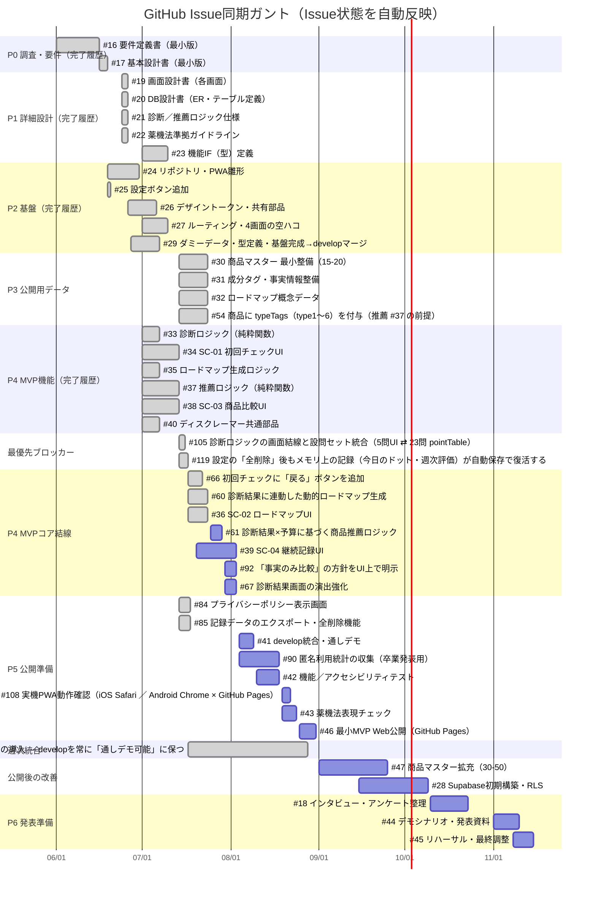
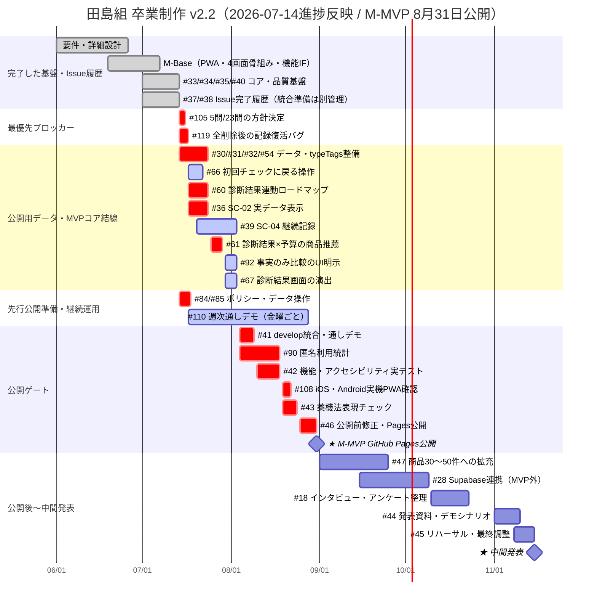

# ガントチャート v2.2（進捗反映版）

**プロジェクト：** 田島組 卒業制作（男の身だしなみアプリ）
**基準日：** 2026-07-14
**作成根拠：** `develop`（`7964b02`）・GitHub Issues（自動同期）・Pull Requests（統合準備状況は 2026-07-14 16:09 JST 時点）
**主目標：** **2026-08-31 までに、4画面をローカルデータで通し操作できる最小MVPを GitHub Pages で公開する。**
**関連：** [実装順序ロードマップ v1.0](./実装順序ロードマップ_v1.0.md)（Issue #109 のSoT文書。フェーズ別の進捗記号・依存整合チェック付き）

> 本書は、実際のGitHub Issues・PRの状態を反映した進捗管理の正本です。日別Excel版・旧版ガントは管理対象外とし、本書のみを最新のスケジュールとして扱います。

<!-- GANTT_ISSUE_SYNC:START -->
## GitHub Issue同期ステータス

**最終同期日：** 2026-07-24
**同期元：** GitHub Issues（タイトル・Issue状態・担当者・緊急度ラベル・マイルストーン・最終更新・完了日時）
**日程の管理元：** `scripts/gantt-issue-map.json`

> **Issue状態はGitHub Issue本体の状態であり、developへの統合済み・リリース準備完了を意味しません。** Issueのクローズ/再オープン、コメント、担当・タイトル・緊急度ラベル・マイルストーンの変更時に、同期ワークフローがこのブロックだけを更新するPRを作成します。日程を変える場合はIssueではなくマッピングJSONを変更してください。

| ガントID | Issue | タスク | Issue状態 | 担当 | 緊急度 | マイルストーン | 最終更新 | 完了日 |
| --- | --- | --- | --- | --- | --- | --- | --- | --- |
| p0a | [#16](https://github.com/itiwoja/tazimagumi_dev_team/issues/16) | 要件定義書（最小版） | 完了 | itiwoja | なし | M-MVP 最小アプリ Web公開 | 2026-06-26 | 2026-06-26 |
| p0c | [#17](https://github.com/itiwoja/tazimagumi_dev_team/issues/17) | 基本設計書（最小版） | 完了 | itiwoja | なし | M-MVP 最小アプリ Web公開 | 2026-06-26 | 2026-06-26 |
| p1b | [#19](https://github.com/itiwoja/tazimagumi_dev_team/issues/19) | 画面設計書（各画面） | 完了 | ren-1222 | なし | M-MVP 最小アプリ Web公開 | 2026-06-26 | 2026-06-26 |
| p1c | [#20](https://github.com/itiwoja/tazimagumi_dev_team/issues/20) | DB設計書（ER・テーブル定義） | 完了 | kuro1020 | なし | M-MVP 最小アプリ Web公開 | 2026-06-26 | 2026-06-26 |
| p1d | [#21](https://github.com/itiwoja/tazimagumi_dev_team/issues/21) | 診断&#47;推薦ロジック仕様 | 完了 | kuro1020 | なし | M-MVP 最小アプリ Web公開 | 2026-06-26 | 2026-06-26 |
| p1f | [#22](https://github.com/itiwoja/tazimagumi_dev_team/issues/22) | 薬機法準拠ガイドライン | 完了 | takato9310 | なし | M-MVP 最小アプリ Web公開 | 2026-06-26 | 2026-06-26 |
| p1g | [#23](https://github.com/itiwoja/tazimagumi_dev_team/issues/23) | 機能IF（型）定義 | 完了 | itiwoja | なし | M-MVP 最小アプリ Web公開 | 2026-06-26 | 2026-06-26 |
| p2a | [#24](https://github.com/itiwoja/tazimagumi_dev_team/issues/24) | リポジトリ・PWA雛形 | 完了 | itiwoja | なし | なし | 2026-06-26 | 2026-06-26 |
| p2s | [#25](https://github.com/itiwoja/tazimagumi_dev_team/issues/25) | 設定ボタン追加 | 完了 | itiwoja | なし | M-MVP 最小アプリ Web公開 | 2026-06-26 | 2026-06-26 |
| p2c | [#26](https://github.com/itiwoja/tazimagumi_dev_team/issues/26) | デザイントークン・共有部品 | 完了 | itiwoja | 高 | M-MVP 最小アプリ Web公開 | 2026-07-14 | 2026-07-14 |
| p2d | [#27](https://github.com/itiwoja/tazimagumi_dev_team/issues/27) | ルーティング・4画面の空ハコ | 完了 | itiwoja | なし | M-MVP 最小アプリ Web公開 | 2026-06-26 | 2026-06-26 |
| p2e | [#29](https://github.com/itiwoja/tazimagumi_dev_team/issues/29) | ダミーデータ・型定義・基盤完成→developマージ | 完了 | itiwoja | 緊急 | M-MVP 最小アプリ Web公開 | 2026-07-07 | 2026-07-07 |
| p3a | [#30](https://github.com/itiwoja/tazimagumi_dev_team/issues/30) | 商品マスター 最小整備&#40;15-20&#41; | 完了 | takato9310, yourenputianjian-sketch, ren-1222 | 緊急 | M-MVP 最小アプリ Web公開 | 2026-07-21 | 2026-07-21 |
| p3b | [#31](https://github.com/itiwoja/tazimagumi_dev_team/issues/31) | 成分タグ・事実情報整備 | 完了 | takato9310, yourenputianjian-sketch, ren-1222 | 緊急 | M-MVP 最小アプリ Web公開 | 2026-07-21 | 2026-07-21 |
| p3c | [#32](https://github.com/itiwoja/tazimagumi_dev_team/issues/32) | ロードマップ概念データ | 完了 | kuro1020 | 緊急 | M-MVP 最小アプリ Web公開 | 2026-07-21 | 2026-07-21 |
| i54 | [#54](https://github.com/itiwoja/tazimagumi_dev_team/issues/54) | 商品に typeTags（type1〜6）を付与（推薦 #37 の前提） | 完了 | takato9310 | 緊急 | M-MVP 最小アプリ Web公開 | 2026-07-17 | 2026-07-17 |
| p4b | [#33](https://github.com/itiwoja/tazimagumi_dev_team/issues/33) | 診断ロジック（純粋関数） | 完了 | kuro1020 | 緊急 | M-MVP 最小アプリ Web公開 | 2026-07-07 | 2026-07-07 |
| p4a | [#34](https://github.com/itiwoja/tazimagumi_dev_team/issues/34) | SC-01 初回チェックUI | 完了 | ren-1222 | 緊急 | M-MVP 最小アプリ Web公開 | 2026-07-14 | 2026-07-14 |
| p4g | [#35](https://github.com/itiwoja/tazimagumi_dev_team/issues/35) | ロードマップ生成ロジック | 完了 | kuro1020 | 緊急 | M-MVP 最小アプリ Web公開 | 2026-07-07 | 2026-07-07 |
| p4h | [#37](https://github.com/itiwoja/tazimagumi_dev_team/issues/37) | 推薦ロジック（純粋関数） | 完了 | takato9310 | 緊急 | M-MVP 最小アプリ Web公開 | 2026-07-14 | 2026-07-14 |
| p4d | [#38](https://github.com/itiwoja/tazimagumi_dev_team/issues/38) | SC-03 商品比較UI | 完了 | yourenputianjian-sketch | 緊急 | M-MVP 最小アプリ Web公開 | 2026-07-14 | 2026-07-14 |
| p4f | [#40](https://github.com/itiwoja/tazimagumi_dev_team/issues/40) | ディスクレーマー共通部品 | 完了 | itiwoja | 緊急 | M-MVP 最小アプリ Web公開 | 2026-07-07 | 2026-07-07 |
| i105 | [#105](https://github.com/itiwoja/tazimagumi_dev_team/issues/105) | 診断ロジックの画面結線と設問セット統合（5問UI ⇄ 23問 pointTable） | 完了 | 未割当 | 緊急 | なし | 2026-07-17 | 2026-07-17 |
| i119 | [#119](https://github.com/itiwoja/tazimagumi_dev_team/issues/119) | 設定の「全削除」後もメモリ上の記録（今日のドット・週次評価）が自動保存で復活する | 完了 | 未割当 | なし | なし | 2026-07-17 | 2026-07-17 |
| i66 | [#66](https://github.com/itiwoja/tazimagumi_dev_team/issues/66) | 初回チェックに「戻る」ボタンを追加 | 完了 | ren-1222 | 高 | なし | 2026-07-21 | 2026-07-21 |
| i60 | [#60](https://github.com/itiwoja/tazimagumi_dev_team/issues/60) | 診断結果に連動した動的ロードマップ生成 | 完了 | kuro1020, ren-1222 | 緊急 | なし | 2026-07-17 | 2026-07-17 |
| p4c | [#36](https://github.com/itiwoja/tazimagumi_dev_team/issues/36) | SC-02 ロードマップUI | 完了 | ren-1222 | 緊急 | M-MVP 最小アプリ Web公開 | 2026-07-17 | 2026-07-17 |
| i61 | [#61](https://github.com/itiwoja/tazimagumi_dev_team/issues/61) | 診断結果×予算に基づく商品推薦ロジック | 未完了 | takato9310, yourenputianjian-sketch | 緊急 | なし | 2026-07-03 | — |
| p4e | [#39](https://github.com/itiwoja/tazimagumi_dev_team/issues/39) | SC-04 継続記録UI | 未完了 | yourenputianjian-sketch | 緊急 | M-MVP 最小アプリ Web公開 | 2026-07-21 | — |
| i92 | [#92](https://github.com/itiwoja/tazimagumi_dev_team/issues/92) | 「事実のみ比較」の方針をUI上で明示 | 未完了 | takato9310, yourenputianjian-sketch | 高 | なし | 2026-07-03 | — |
| i67 | [#67](https://github.com/itiwoja/tazimagumi_dev_team/issues/67) | 診断結果画面の演出強化 | 未完了 | ren-1222 | 高 | なし | 2026-07-03 | — |
| i84 | [#84](https://github.com/itiwoja/tazimagumi_dev_team/issues/84) | プライバシーポリシー表示画面 | 完了 | ikki-claude | 高 | なし | 2026-07-17 | 2026-07-17 |
| i85 | [#85](https://github.com/itiwoja/tazimagumi_dev_team/issues/85) | 記録データのエクスポート・全削除機能 | 完了 | ikki-claude | 高 | なし | 2026-07-14 | 2026-07-14 |
| i110 | [#110](https://github.com/itiwoja/tazimagumi_dev_team/issues/110) | 週次統合ルールの導入 — developを常に「通しデモ可能」に保つ | 完了 | ikki-claude | 緊急 | なし | 2026-07-17 | 2026-07-17 |
| p5a | [#41](https://github.com/itiwoja/tazimagumi_dev_team/issues/41) | develop統合・通しデモ | 未完了 | kuro1020, takato9310, yourenputianjian-sketch, ren-1222, ikki-claude | 緊急 | M-MVP 最小アプリ Web公開 | 2026-07-17 | — |
| i90 | [#90](https://github.com/itiwoja/tazimagumi_dev_team/issues/90) | 匿名利用統計の収集（卒業発表用） | 未完了 | kuro1020, takato9310, yourenputianjian-sketch, ren-1222, ikki-claude | 高 | なし | 2026-07-17 | — |
| p5b | [#42](https://github.com/itiwoja/tazimagumi_dev_team/issues/42) | 機能&#47;アクセシビリティテスト | 未完了 | kuro1020, takato9310, yourenputianjian-sketch, ren-1222, ikki-claude | 緊急 | なし | 2026-07-17 | — |
| i108 | [#108](https://github.com/itiwoja/tazimagumi_dev_team/issues/108) | 実機PWA動作確認（iOS Safari &#47; Android Chrome × GitHub Pages） | 未完了 | ikki-claude | 高 | なし | 2026-07-21 | — |
| p5c | [#43](https://github.com/itiwoja/tazimagumi_dev_team/issues/43) | 薬機法表現チェック | 未完了 | takato9310 | 緊急 | M-MVP 最小アプリ Web公開 | 2026-07-03 | — |
| p5d | [#46](https://github.com/itiwoja/tazimagumi_dev_team/issues/46) | 最小MVP Web公開（GitHub Pages） | 未完了 | ikki-claude | 緊急 | M-MVP 最小アプリ Web公開 | 2026-07-21 | — |
| p3d | [#47](https://github.com/itiwoja/tazimagumi_dev_team/issues/47) | 商品マスター拡充&#40;30-50&#41; | 未完了 | takato9310 | 低 | なし | 2026-07-09 | — |
| p2b | [#28](https://github.com/itiwoja/tazimagumi_dev_team/issues/28) | Supabase初期構築・RLS | 未完了 | ikki-claude | 低 | なし | 2026-07-17 | — |
| p0b | [#18](https://github.com/itiwoja/tazimagumi_dev_team/issues/18) | インタビュー・アンケート整理 | 未完了 | takato9310 | 高 | なし | 2026-07-03 | — |
| p6a | [#44](https://github.com/itiwoja/tazimagumi_dev_team/issues/44) | デモシナリオ・発表資料 | 未完了 | kuro1020, takato9310, yourenputianjian-sketch, ren-1222, ikki-claude | 中 | なし | 2026-07-17 | — |
| p6b | [#45](https://github.com/itiwoja/tazimagumi_dev_team/issues/45) | リハーサル・最終調整 | 未完了 | kuro1020, takato9310, yourenputianjian-sketch, ren-1222, ikki-claude | 中 | なし | 2026-07-17 | — |

<!-- GANTT_ISSUE_SYNC:END -->

---

## Issue同期の運用

- **GitHub IssuesがIssue状態・タイトル・担当者・緊急度ラベル・マイルストーン・最終更新・完了日の正**です。Issueをクローズ/再オープン/編集、コメント、担当・ラベル・マイルストーンを変更すると、`.github/workflows/sync-gantt-issues.yml` が同期PRを作成または更新します。
- **日程・ガントID・Issue番号の対応**は `scripts/gantt-issue-map.json` が正です。日程を変更する場合は、このファイルを更新してください。
- ローカルで同期する場合は `node scripts/sync-gantt-issues.mjs`、差分だけ確認する場合は `node scripts/sync-gantt-issues.mjs --check` を実行します。
- 自動更新対象は `<!-- GANTT_ISSUE_SYNC:START -->` と `<!-- GANTT_ISSUE_SYNC:END -->` の間だけです。手動の説明・役割・リスクは上書きされません。
- 自動同期表の「完了」は**Issueがclosedであることだけ**を示します。PRの競合、CI、Revert、`develop` 統合、実機確認は下記の手動スナップショットで別に管理します。

---

## 1. 現在地と判断

- **基盤（M-Base）は完了済み**です。PWA雛形、4画面の骨組み、機能IF、ローカル永続化、ディスクレーマー、デバッグモード、GitHub Pages自動デプロイ、PRチェックCIは `develop` に反映されています（#23〜#29、#40、#58、#73、#76、#80、#81、#107、#113）。
- **SC-01、診断ロジック、ロードマップ生成ロジックは実装済み**です（#33〜#35）。一方、診断の**5問UIと23問前提のロジックが未統合**であり、画面から診断を呼べていません（#105）。これはM-MVPの最優先ブロッカーです。
- **SC-03比較UI #38 はIssueがclosed**ですが、Revert PR #139 は open / mergeable の一方で `PR Check` が失敗中です。PR #139 は未マージなので、Issue状態だけからRevert済み・リリース準備完了とは判断しません。
- **推薦ロジック #37 はIssueがclosedでも、PR #137 は open / conflicting**です。商品データPR #141 と `typeTags` 付与PR #136 も競合中です。`typeTags` / `type_tags` の命名不一致を解消し、#54 → #37/#61 の依存順で統合します。
- **テストIssue #42 はopen**です。PR #142 はテストチェックリストと静的a11y点検レポートを追加する文書PRとして open / mergeable・チェックgreenですが、実テスト実行と人間による実機確認はまだ完了していません。
- 開発終盤に一括統合せず、#110 の提案どおり、**毎週金曜に `develop` の通しデモを実施し、壊れていれば翌週へ持ち越さず先に修正する**運用を採用候補とします。正式なチーム合意は人間が行います。

### PR統合準備スナップショット（2026-07-14 16:09 JST）

| PR | 対象 | GitHub上の状態 | ガント上の扱い |
| --- | --- | --- | --- |
| #124 / #125 | #85 データ操作 / #84 プライバシー | open / conflicting | Issueはopen。競合解消・レビュー・`develop` 統合待ち |
| #135 | #119 全削除後の復活バグ | open / conflicting | 最優先ブロッカーのまま。修正は未統合 |
| #136 / #137 / #141 | #54 typeTags / #37 推薦 / 商品データ | open / conflicting | #54を先に整え、命名とデータ形式を統一してから#61へ結線 |
| #128 / #129 / #130 | #110週次統合 / #112負荷平準化 / #109順序文書 | open / mergeable（チェックがあるものはgreen） | 運用・文書提案。人間の合意とマージは別途必要 |
| #140 | P5統合監査レポート | open / mergeable・チェックgreen | 監査文書であり、各機能の統合完了を意味しない |
| #142 | #42テストチェックリスト・静的a11y点検 | open / mergeable・チェックgreen | 準備資料あり。実テストと人間の実機確認は未完了 |
| #139 | SC-03 Revert | open / mergeable・`PR Check`失敗 | 未マージ。失敗理由を直し、Revert/再統合方針を判断する |

---

## 2. メンバー別の役割・直近責任

| メンバー | プロジェクト上の役割 | これまでの主な進捗 | 7/14以降の主担当・完了条件 |
| --- | --- | --- | --- |
| **村上壱基** (`itiwoja`) | リーダー、基盤・共有部品管理、品質管理、マージ/公開責任 | M-Base、設定、デバッグ、Pages/CI、永続化、ディスクレーマーを統合 | #105の方針決定をひろとと合意し、競合PRの統合順を管理。#41通しデモ、#42の実テスト、#108実機確認、#46公開のゲートを管理する。 |
| **新田漣（れん）** (`ren-1222`) | サブリーダー、SC-01/SC-02 UI | SC-01 UIを完了（#34） | #105の結線方針に合わせSC-01を調整し、SC-02ロードマップUI（#36）を実データで表示可能にする。 |
| **饒波廣翔（ひろと）** (`kuro1020`) | 進捗・課題管理、診断/ロードマップロジック | 診断（#33）・ロードマップ生成（#35）を実装 | 村上と#105のA/Bを決定し、診断→状態→ロードマップの最小結線を完成させる。ロードマップ概念データ（#32）はたかとと整合する。 |
| **仲程天飛（たかと）** (`takato9310`) | 進捗・人員管理、商品データ、推薦、薬機法表現 | 推薦ロジックIssue #37を実装、商品データ拡充PR #141を提出 | `typeTags` へ統一して競合中のPR #136/#137/#141を解消する。商品15〜20件（#30）、成分/事実情報（#31）、公開前薬機法確認（#43）を完了する。データ調査は#112に従いチーム分担を提案する。 |
| **田島優人（ゆうと）** (`yourenputianjian-sketch`) | 課題・人員管理、SC-03/SC-04 UI | SC-03比較UI #38を実装。Revert PR #139は未マージ・チェック失敗中 | SC-03のRevert/再統合方針を決め、推薦データと整合させる。SC-04継続記録UI（#39）はlocalStorage保存/復元と#119の解消まで確認する。 |
| **全員** | 統合・品質・発表 | 基盤完成後に各機能を並行開発中 | PR #142のチェックリストを準備資料として使い、実テスト（#42）、実機PWA確認（#108）、金曜通しデモ、M-MVP公開判定、発表準備を共同で行う。 |

> 共有ファイル（`app/css/style.css`、`app/js/state.js`、`app/js/main.js`）は村上が一次管理です。各実装は必ず `develop` 起点の1タスク1ブランチとし、PRの宛先は `develop` にします。

---

## 3. 進捗ガントチャート

> 7/14以降の日付は、8/31公開と #109 の依存順を守るための**提案スケジュール**です。#59（初回チェック23問拡張）は #105 で方針Bを選んだ場合だけ公開前へ移す条件付きタスクです。方針未決定のため固定日程の自動同期対象と手動ガントの双方から除外し、方針Aなら公開後に置きます。

---

## 4. タスク別進捗・依存・担当

| 優先 | タスク | 状態（Issue同期 / PR 16:09 JST確認） | 担当 | 目標日 | 依存・次アクション |
| --- | --- | --- | --- | --- | --- |
| **P0** | #105 診断と設問セットの統合方針 | **Issue open・最優先** | 村上 / ひろと | 07/16 | 5問にロジックを合わせるA、または23問へUIを拡張するBを合意。決定は人間が行う。 |
| **P0** | #119 全削除後の記録復活バグ | Issue open・PR #135 conflicting | 村上 / ゆうと | 07/17 | 競合を解消して統合し、全削除後の自動保存で記録が復活しないことを確認。 |
| **P0** | #30/#31/#32/#54 公開用データ・typeTags | Issues open・PR #136/#141 conflicting | たかと（調査分担は全員） | 07/24 | 検証器を先に使い、`typeTags` に統一。15〜20件とロードマップ概念データを実結線前に揃える。 |
| **P0** | #66 戻る操作 / #60 動的ロードマップ / #36 SC-02 | Issues open | れん / ひろと / 村上 | 07/22〜07/24 | #105後に診断結果をstateへ保存し、#35の生成結果をS2へ表示する。 |
| **P0** | #37 推薦履歴 / #61 商品推薦の実結線 | #37 closed・PR #137 conflicting、#61 open | たかと / ゆうと / 村上 | 07/29 | #54と商品データを先に統合し、診断結果×予算で実商品候補が返ることを確認。 |
| **P1** | #38 SC-03 比較UIの再確認・結線 | #38 closed・Revert PR #139 mergeableだが`PR Check`失敗 | ゆうと / たかと / 村上 | 08/03 | 未マージのRevert理由とCI失敗を解消し、#61/#92と同じ商品形式で再確認する。 |
| **P1** | #39 SC-04 継続記録UI | Issue open | ゆうと | 08/03 | 記録、週次評価、localStorage保存/復元、#119解消、全削除後に復活しないことを確認。 |
| **P1** | #92 事実のみ比較 / #67 結果画面演出 | Issues open | ゆうと / たかと / れん | 08/03 | コア結線後に、比較の根拠表示と結果画面の状態・演出を仕上げる。 |
| **P1** | #84 プライバシー / #85データ操作 | Issues open・PR #125/#124 conflicting | 村上 | 07/18 | 競合解消・レビュー後に統合し、表示・JSONエクスポート・全削除を利用者操作で確認。 |
| **P1** | #110 週次統合ルール | Issue open・PR #128 mergeable | 全員（運用責任：村上） | 07/17開始 | 人間が運用を合意・マージし、毎週金曜のPages/develop通しデモ結果を記録する。 |
| **P2** | #41 統合・通しデモ | Issue open・監査PR #140 mergeable / green | 全員 | 08/09 | #140は監査文書。未結線・競合PR・命名不一致を解消し、実際に`develop`で通しデモする。 |
| **P2** | #90 匿名利用統計 | Issue open | 村上 / 全員 | 08/18 | 公開前に収集仕様と同意・プライバシー影響を確認し、公開日から必要なデータだけを収集する。 |
| **P2** | #42 テスト / #108 実機PWA | Issues open・PR #142 mergeable / green（準備資料） | 全員 | 08/22 | チェックリスト作成・静的a11y点検と、実テスト・人間によるiOS/Android実機確認を分け、後者まで完了させる。 |
| **P2** | #43 薬機法表現チェック | Issue open | たかと / 村上 | 08/24 | 公開データと全画面の表現を、確定版の実データで確認する。 |
| **P2** | #46 M-MVP公開 | Issue open（Pages自動デプロイ基盤は完了） | 村上 / 全員 | **08/31** | #41/#42/#43/#108と公開前修正が完了し、公開URLで4画面の通し操作が成功すること。 |
| P3 | #47 データ拡充 / #28 Supabase | Issues open・MVP外 | たかと / ひろと / 村上 | 09/01〜10/09 | M-MVPの安定を優先し、公開条件には含めない。 |
| P3 | #18 インタビュー・アンケート整理 | Issue open・#109の発表準備フェーズ | たかと | 10/23 | 公開後の結果も含めて整理し、#44の発表資料へ渡す。 |
| 条件付き | #59 初回チェック23問拡張 | Issue open・固定日程から除外 | れん / ひろと / 村上 | #105決定後 | 方針Bなら公開前へ、方針Aなら公開後へ置く。未決定のため自動同期マップへは入れない。 |
| P4 | #44/#45 発表準備 | Issues open | 全員 | 11/15 | 公開版の利用実績と#18の整理結果を反映し、デモ・資料・リハーサルを完成する。 |

---

## 5. M-MVP公開の達成条件（8/31）

以下を**すべて満たした時だけ** #46 を完了扱いにします。

1. GitHub Pagesの公開URLで、**初回チェック → 結果/ロードマップ → 商品候補・比較 → 継続記録**を止まらずに操作できる。
2. 診断結果がS2/S3の内容へ反映され、UIとロジックの設問セットが一致している（#105）。
3. 商品データは最低15〜20件で、各商品の必須項目と `typeTags` を検証済み。推薦・比較に使用できる。
4. 記録データがlocalStorageに保存・復元され、全削除後に復活しない（#119）。JSONエクスポートも動作する。
5. 公開前に薬機法表現・プライバシー表示・アクセシビリティ基本項目を確認済み。
6. iOS Safari と Android Chrome の少なくとも各1実機で、PWA/画面遷移/主要操作を確認済み。
7. `develop` を基準に通しデモ、JS構文、CI、Service Worker更新を確認済み。

---

## 6. リスクと運用ルール

| リスク | 影響 | 対策・判断基準 |
| --- | --- | --- |
| #105が未決定 | 診断・ロードマップ・推薦の結線が止まる | 07/16までに村上・ひろとが方針を合意。決まらなければ23問拡張をMVP外とし、5問整合を優先。 |
| データ/推薦PRの競合 | 商品比較・推薦が統合できない | `typeTags`へ統一し、PR #136/#137/#141の競合を解消して #54 → #37/#61 の順で統合。 |
| SC-03 RevertのCI失敗 | Revertも再統合も判断できず、比較機能の状態が曖昧になる | PR #139は未マージのまま`PR Check`失敗を直し、Revert理由と再統合の受入条件をレビューする。 |
| 公開前機能PRの競合 | プライバシー・データ操作・全削除修正が`develop`へ入らない | PR #124/#125/#135の競合を07/18までに解消し、Issue状態とは別に利用者操作で確認する。 |
| テスト準備と実行の混同 | チェックリストだけで#42を完了扱いし、実機不具合を見逃す | PR #142は準備資料として扱い、実テスト結果と人間によるiOS/Android確認を別途記録する。 |
| #59の条件が未決定 | 23問拡張が公開前計画へ無条件に入り、クリティカルパスを圧迫する | 固定日程から除外し、#105で方針Bなら公開前、方針Aなら公開後へ配置する。 |
| データ整備とレビューの集中 | たかと・村上がボトルネックになる | #112の方針で商品調査をカテゴリ分割、機械検証はCIへ、共有ファイルに触れないPRは相互レビューを提案。 |
| 終盤の一括統合 | 公開直前に問題が連鎖する | 金曜ごとの通しデモ。壊れた`develop`は翌週に持ち越さず、機能追加より修正を優先。 |
| 公開後のキャッシュ | 修正版が利用者に届かない | #107のService Worker運用に従い、リリース時にキャッシュ更新と実URL確認を行う。 |

---

## 7. 参照したGitHub項目

- **進捗・優先順位:** [#109 実装順序ロードマップ](https://github.com/itiwoja/tazimagumi_dev_team/issues/109)（SoT文書化: [`docs/schedule/実装順序ロードマップ_v1.0.md`](./実装順序ロードマップ_v1.0.md)。進捗記号・依存整合チェック付き）
- **最優先の統合判断:** [#105 診断ロジックと設問セット統合](https://github.com/itiwoja/tazimagumi_dev_team/issues/105)
- **運用提案:** [#110 週次統合](https://github.com/itiwoja/tazimagumi_dev_team/issues/110)、[#112 負荷平準化](https://github.com/itiwoja/tazimagumi_dev_team/issues/112)
- **公開クリティカルパス:** [#41 統合](https://github.com/itiwoja/tazimagumi_dev_team/issues/41)、[#42 テスト](https://github.com/itiwoja/tazimagumi_dev_team/issues/42)、[#43 薬機法](https://github.com/itiwoja/tazimagumi_dev_team/issues/43)、[#46 公開](https://github.com/itiwoja/tazimagumi_dev_team/issues/46)、[#108 実機PWA確認](https://github.com/itiwoja/tazimagumi_dev_team/issues/108)
- **競合中の実装PR:** [#124 データエクスポート](https://github.com/itiwoja/tazimagumi_dev_team/pull/124)、[#125 プライバシー](https://github.com/itiwoja/tazimagumi_dev_team/pull/125)、[#135 全削除修正](https://github.com/itiwoja/tazimagumi_dev_team/pull/135)、[#136 typeTags](https://github.com/itiwoja/tazimagumi_dev_team/pull/136)、[#137 推薦ロジック](https://github.com/itiwoja/tazimagumi_dev_team/pull/137)、[#141 商品データ](https://github.com/itiwoja/tazimagumi_dev_team/pull/141)
- **mergeableな提案・監査・テスト準備:** [#128 週次統合](https://github.com/itiwoja/tazimagumi_dev_team/pull/128)、[#129 負荷平準化](https://github.com/itiwoja/tazimagumi_dev_team/pull/129)、[#130 順序文書](https://github.com/itiwoja/tazimagumi_dev_team/pull/130)、[#140 統合監査](https://github.com/itiwoja/tazimagumi_dev_team/pull/140)、[#142 テスト準備](https://github.com/itiwoja/tazimagumi_dev_team/pull/142)
- **CI失敗中:** [#139 SC-03 Revert](https://github.com/itiwoja/tazimagumi_dev_team/pull/139)（open / mergeable、`PR Check`失敗、未マージ）

---

## 8. 改訂履歴

| 日付 | 版 | 内容 |
| --- | --- | --- |
| 2026-06-26 | v2.1 | 8/31の最小MVP Web公開を主目標に設定。 |
| 2026-07-14 | **v2.2** | GitHub Issuesの状態・担当・緊急度・マイルストーン・更新/完了日を自動同期。#109の依存順に日程を再配置し、Issue状態とPR統合準備を分離。競合/CI、#142のテスト準備、#59の条件付き扱い、8/31公開ゲートを反映。 |

作成チーム：田島組 ／ 沖縄みらいAI&IT専門学校 卒業制作
