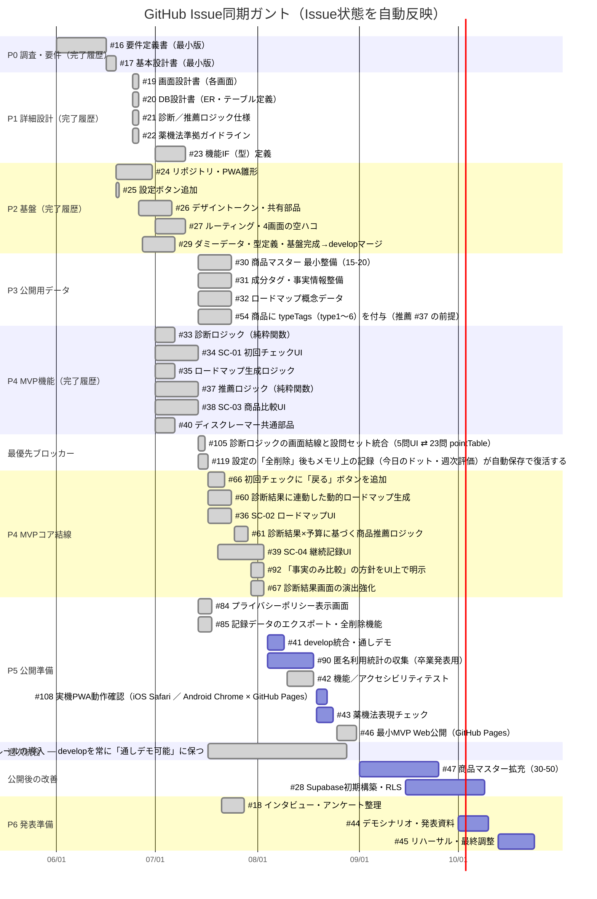

# ガントチャート v2.2（2026-09-04更新版）

**プロジェクト：** 田島組 卒業制作（男の身だしなみアプリ）
**基準日：** 2026-09-04
**作成根拠：** `develop`（`4859755`）・`main`（`a5f82d2`）・`app/` の現行実装・`scripts/` のローカル検証・GitHub Issues（自動同期）
**主目標：** **M-MVPは `main` へのリリースと Cloudflare Pages 本番デプロイまで完了した。現在は公開URLでの4画面通し操作、実機、薬機法確認を完了させ、中間発表に向けた商品データ拡充と発表準備を進める。**
**関連：** [実装順序ロードマップ v1.0](./実装順序ロードマップ_v1.0.md)（Issue #109 のSoT文書。フェーズ別の進捗記号・依存整合チェック付き）

> 本書は、GitHub Issuesの状態と、`develop` に統合された実装の到達点を分けて管理する進捗資料です。日別Excel版・旧版ガントは管理対象外とし、本書のみを最新のスケジュールとして扱います。

<!-- GANTT_ISSUE_SYNC:START -->
## GitHub Issue同期ステータス

**最終同期日：** 2026-09-04
**同期元：** GitHub Issues（タイトル・Issue状態・担当者・緊急度ラベル・マイルストーン・最終更新・完了日時）
**日程の管理元：** `scripts/gantt-issue-map.json`

> **Issue状態はGitHub Issue本体の状態であり、developへの統合済み・リリース準備完了を意味しません。** Issueのクローズ/再オープン、コメント、担当・タイトル・緊急度ラベル・マイルストーンの変更時に、同期ワークフローがこのブロックだけを更新するPRを作成します。日程を変える場合はIssueではなくマッピングJSONを変更してください。

| ガントID | Issue | タスク | Issue状態 | 担当 | 緊急度 | マイルストーン | 最終更新 | 完了日 |
| --- | --- | --- | --- | --- | --- | --- | --- | --- |
| p0a | [#16](https://github.com/itiwoja/tazimagumi_dev_team/issues/16) | 要件定義書（最小版） | 完了 | itiwoja | なし | M-MVP 最小アプリ Web公開 | 2026-06-26 | 2026-06-26 |
| p0c | [#17](https://github.com/itiwoja/tazimagumi_dev_team/issues/17) | 基本設計書（最小版） | 完了 | itiwoja | なし | M-MVP 最小アプリ Web公開 | 2026-06-26 | 2026-06-26 |
| p1b | [#19](https://github.com/itiwoja/tazimagumi_dev_team/issues/19) | 画面設計書（各画面） | 完了 | ren-1222 | なし | M-MVP 最小アプリ Web公開 | 2026-06-26 | 2026-06-26 |
| p1c | [#20](https://github.com/itiwoja/tazimagumi_dev_team/issues/20) | DB設計書（ER・テーブル定義） | 完了 | kuro1020 | なし | M-MVP 最小アプリ Web公開 | 2026-06-26 | 2026-06-26 |
| p1d | [#21](https://github.com/itiwoja/tazimagumi_dev_team/issues/21) | 診断&#47;推薦ロジック仕様 | 完了 | kuro1020 | なし | M-MVP 最小アプリ Web公開 | 2026-06-26 | 2026-06-26 |
| p1f | [#22](https://github.com/itiwoja/tazimagumi_dev_team/issues/22) | 薬機法準拠ガイドライン | 完了 | takato9310 | なし | M-MVP 最小アプリ Web公開 | 2026-06-26 | 2026-06-26 |
| p1g | [#23](https://github.com/itiwoja/tazimagumi_dev_team/issues/23) | 機能IF（型）定義 | 完了 | itiwoja | なし | M-MVP 最小アプリ Web公開 | 2026-06-26 | 2026-06-26 |
| p2a | [#24](https://github.com/itiwoja/tazimagumi_dev_team/issues/24) | リポジトリ・PWA雛形 | 完了 | itiwoja | なし | なし | 2026-06-26 | 2026-06-26 |
| p2s | [#25](https://github.com/itiwoja/tazimagumi_dev_team/issues/25) | 設定ボタン追加 | 完了 | itiwoja | なし | M-MVP 最小アプリ Web公開 | 2026-06-26 | 2026-06-26 |
| p2c | [#26](https://github.com/itiwoja/tazimagumi_dev_team/issues/26) | デザイントークン・共有部品 | 完了 | itiwoja | 高 | M-MVP 最小アプリ Web公開 | 2026-07-14 | 2026-07-14 |
| p2d | [#27](https://github.com/itiwoja/tazimagumi_dev_team/issues/27) | ルーティング・4画面の空ハコ | 完了 | itiwoja | なし | M-MVP 最小アプリ Web公開 | 2026-06-26 | 2026-06-26 |
| p2e | [#29](https://github.com/itiwoja/tazimagumi_dev_team/issues/29) | ダミーデータ・型定義・基盤完成→developマージ | 完了 | itiwoja | 緊急 | M-MVP 最小アプリ Web公開 | 2026-07-07 | 2026-07-07 |
| p3a | [#30](https://github.com/itiwoja/tazimagumi_dev_team/issues/30) | 商品マスター 最小整備&#40;15-20&#41; | 完了 | takato9310, yourenputianjian-sketch, ren-1222 | 緊急 | M-MVP 最小アプリ Web公開 | 2026-07-21 | 2026-07-21 |
| p3b | [#31](https://github.com/itiwoja/tazimagumi_dev_team/issues/31) | 成分タグ・事実情報整備 | 完了 | takato9310, yourenputianjian-sketch, ren-1222 | 緊急 | M-MVP 最小アプリ Web公開 | 2026-07-21 | 2026-07-21 |
| p3c | [#32](https://github.com/itiwoja/tazimagumi_dev_team/issues/32) | ロードマップ概念データ | 完了 | kuro1020 | 緊急 | M-MVP 最小アプリ Web公開 | 2026-07-21 | 2026-07-21 |
| i54 | [#54](https://github.com/itiwoja/tazimagumi_dev_team/issues/54) | 商品に typeTags（type1〜6）を付与（推薦 #37 の前提） | 完了 | takato9310 | 緊急 | M-MVP 最小アプリ Web公開 | 2026-07-17 | 2026-07-17 |
| p4b | [#33](https://github.com/itiwoja/tazimagumi_dev_team/issues/33) | 診断ロジック（純粋関数） | 完了 | kuro1020 | 緊急 | M-MVP 最小アプリ Web公開 | 2026-07-07 | 2026-07-07 |
| p4a | [#34](https://github.com/itiwoja/tazimagumi_dev_team/issues/34) | SC-01 初回チェックUI | 完了 | ren-1222 | 緊急 | M-MVP 最小アプリ Web公開 | 2026-07-14 | 2026-07-14 |
| p4g | [#35](https://github.com/itiwoja/tazimagumi_dev_team/issues/35) | ロードマップ生成ロジック | 完了 | kuro1020 | 緊急 | M-MVP 最小アプリ Web公開 | 2026-07-07 | 2026-07-07 |
| p4h | [#37](https://github.com/itiwoja/tazimagumi_dev_team/issues/37) | 推薦ロジック（純粋関数） | 完了 | takato9310 | 緊急 | M-MVP 最小アプリ Web公開 | 2026-07-14 | 2026-07-14 |
| p4d | [#38](https://github.com/itiwoja/tazimagumi_dev_team/issues/38) | SC-03 商品比較UI | 完了 | yourenputianjian-sketch | 緊急 | M-MVP 最小アプリ Web公開 | 2026-07-14 | 2026-07-14 |
| p4f | [#40](https://github.com/itiwoja/tazimagumi_dev_team/issues/40) | ディスクレーマー共通部品 | 完了 | itiwoja | 緊急 | M-MVP 最小アプリ Web公開 | 2026-07-07 | 2026-07-07 |
| i105 | [#105](https://github.com/itiwoja/tazimagumi_dev_team/issues/105) | 診断ロジックの画面結線と設問セット統合（5問UI ⇄ 23問 pointTable） | 完了 | 未割当 | 緊急 | なし | 2026-07-17 | 2026-07-17 |
| i119 | [#119](https://github.com/itiwoja/tazimagumi_dev_team/issues/119) | 設定の「全削除」後もメモリ上の記録（今日のドット・週次評価）が自動保存で復活する | 完了 | 未割当 | なし | なし | 2026-07-17 | 2026-07-17 |
| i66 | [#66](https://github.com/itiwoja/tazimagumi_dev_team/issues/66) | 初回チェックに「戻る」ボタンを追加 | 完了 | ren-1222 | 高 | なし | 2026-07-21 | 2026-07-21 |
| i60 | [#60](https://github.com/itiwoja/tazimagumi_dev_team/issues/60) | 診断結果に連動した動的ロードマップ生成 | 完了 | kuro1020, ren-1222 | 緊急 | なし | 2026-07-17 | 2026-07-17 |
| p4c | [#36](https://github.com/itiwoja/tazimagumi_dev_team/issues/36) | SC-02 ロードマップUI | 完了 | ren-1222 | 緊急 | M-MVP 最小アプリ Web公開 | 2026-07-17 | 2026-07-17 |
| i61 | [#61](https://github.com/itiwoja/tazimagumi_dev_team/issues/61) | 診断結果×予算に基づく商品推薦ロジック | 完了 | takato9310, yourenputianjian-sketch | 緊急 | なし | 2026-08-26 | 2026-08-26 |
| p4e | [#39](https://github.com/itiwoja/tazimagumi_dev_team/issues/39) | SC-04 継続記録UI | 完了 | yourenputianjian-sketch | 緊急 | M-MVP 最小アプリ Web公開 | 2026-07-28 | 2026-07-28 |
| i92 | [#92](https://github.com/itiwoja/tazimagumi_dev_team/issues/92) | 「事実のみ比較」の方針をUI上で明示 | 完了 | takato9310, yourenputianjian-sketch | 高 | なし | 2026-08-26 | 2026-08-26 |
| i67 | [#67](https://github.com/itiwoja/tazimagumi_dev_team/issues/67) | 診断結果画面の演出強化 | 完了 | ren-1222 | 高 | なし | 2026-08-31 | 2026-08-31 |
| i84 | [#84](https://github.com/itiwoja/tazimagumi_dev_team/issues/84) | プライバシーポリシー表示画面 | 完了 | ikki-claude | 高 | なし | 2026-07-17 | 2026-07-17 |
| i85 | [#85](https://github.com/itiwoja/tazimagumi_dev_team/issues/85) | 記録データのエクスポート・全削除機能 | 完了 | ikki-claude | 高 | なし | 2026-07-14 | 2026-07-14 |
| i110 | [#110](https://github.com/itiwoja/tazimagumi_dev_team/issues/110) | 週次統合ルールの導入 — developを常に「通しデモ可能」に保つ | 完了 | ikki-claude | 緊急 | なし | 2026-07-17 | 2026-07-17 |
| p5a | [#41](https://github.com/itiwoja/tazimagumi_dev_team/issues/41) | develop統合・通しデモ | 未完了 | kuro1020, takato9310, yourenputianjian-sketch, ren-1222, ikki-claude | 緊急 | M-MVP 最小アプリ Web公開 | 2026-07-17 | — |
| i90 | [#90](https://github.com/itiwoja/tazimagumi_dev_team/issues/90) | 匿名利用統計の収集（卒業発表用） | 未完了 | kuro1020, takato9310, yourenputianjian-sketch, ren-1222, ikki-claude | 高 | なし | 2026-07-17 | — |
| p5b | [#42](https://github.com/itiwoja/tazimagumi_dev_team/issues/42) | 機能&#47;アクセシビリティテスト | 完了 | kuro1020, takato9310, yourenputianjian-sketch, ren-1222, ikki-claude | 緊急 | なし | 2026-07-28 | 2026-07-28 |
| i108 | [#108](https://github.com/itiwoja/tazimagumi_dev_team/issues/108) | 実機PWA動作確認（iOS Safari &#47; Android Chrome × GitHub Pages） | 未完了 | ikki-claude | 高 | なし | 2026-07-21 | — |
| p5c | [#43](https://github.com/itiwoja/tazimagumi_dev_team/issues/43) | 薬機法表現チェック | 未完了 | takato9310 | 緊急 | M-MVP 最小アプリ Web公開 | 2026-07-03 | — |
| p5d | [#46](https://github.com/itiwoja/tazimagumi_dev_team/issues/46) | 最小MVP Web公開（GitHub Pages） | 完了 | ikki-claude | 緊急 | M-MVP 最小アプリ Web公開 | 2026-07-28 | 2026-07-28 |
| p3d | [#47](https://github.com/itiwoja/tazimagumi_dev_team/issues/47) | 商品マスター拡充&#40;30-50&#41; | 未完了 | takato9310 | 低 | なし | 2026-07-09 | — |
| p2b | [#28](https://github.com/itiwoja/tazimagumi_dev_team/issues/28) | Supabase初期構築・RLS | 未完了 | ikki-claude | 低 | なし | 2026-07-17 | — |
| p0b | [#18](https://github.com/itiwoja/tazimagumi_dev_team/issues/18) | インタビュー・アンケート整理 | 完了 | takato9310 | 高 | なし | 2026-07-28 | 2026-07-28 |
| p6a | [#44](https://github.com/itiwoja/tazimagumi_dev_team/issues/44) | デモシナリオ・発表資料 | 未完了 | kuro1020, takato9310, yourenputianjian-sketch, ren-1222, ikki-claude | 中 | なし | 2026-07-17 | — |
| p6b | [#45](https://github.com/itiwoja/tazimagumi_dev_team/issues/45) | リハーサル・最終調整 | 未完了 | kuro1020, takato9310, yourenputianjian-sketch, ren-1222, ikki-claude | 中 | なし | 2026-07-17 | — |


<!-- GANTT_ISSUE_SYNC:END -->

---

## Issue同期の運用

- **GitHub IssuesがIssue状態・タイトル・担当者・緊急度ラベル・マイルストーン・最終更新・完了日の正**です。Issueをクローズ/再オープン/編集、コメント、担当・ラベル・マイルストーンを変更すると、`.github/workflows/sync-gantt-issues.yml` が同期PRを作成または更新します。
- **日程・ガントID・Issue番号の対応**は `scripts/gantt-issue-map.json` が正です。日程を変更する場合は、このファイルを更新してください。
- ローカルで同期する場合は `node scripts/sync-gantt-issues.mjs`、差分だけ確認する場合は `node scripts/sync-gantt-issues.mjs --check` を実行します。
- 自動更新対象は `<!-- GANTT_ISSUE_SYNC:START -->` と `<!-- GANTT_ISSUE_SYNC:END -->` の間だけです。手動の説明・役割・リスクは上書きされません。
- 自動同期表の「完了」は**Issueがclosedであることだけ**を示します。PRの競合、CI、Revert、`develop` 統合、実機確認は下記の手動スナップショットで別に管理します。

---

## 1. 実装スナップショット（2026-09-04）

### 1.1 現行の利用フロー

現行の `develop`（`4859755`）では、M-MVPの4画面に導入画面を加えた次の流れが実装されています。

1. **SC-00 導入**：初回のみ表示し、設定から再表示できます。
2. **S1 初回チェック**：5問の選択式UIから `App.diagnose` を呼び出し、診断結果をstateへ保存します。
3. **S2 ロードマップ**：診断結果から `App.buildRoadmap` で動的に生成し、対応する商品カテゴリへ移動できます。
4. **S3 商品候補・比較**：診断結果と予算帯から推薦し、最大3商品を比較できます。NG成分除外、代替候補、成分類似商品、事実ベースの比較表示、店員向け質問例にも対応しています。
5. **S4 継続記録**：今日の記録、週次自己評価、過去2週の履歴、累計記録日数を扱います。
6. **設定**：リマインド時刻、避けたい成分、診断リセット、導入画面の再表示、JSONエクスポート、全削除、プライバシー表示を提供します。

### 1.2 実装・データ・検証の到達点

| 範囲 | 現状 | 根拠 |
| --- | --- | --- |
| 画面・ルーティング | 実装済み | `app/index.html` の SC-00／S1〜S4 と `app/js/main.js`・`app/js/screens.js` |
| 診断・ロードマップ結線 | 実装済み | `App.diagnose` → state → `App.buildRoadmap` → S2。MVPは5問セットで運用 |
| 商品推薦・比較 | 実装済み | `app/js/contracts.js`・`app/js/s3.js`。診断×予算、最大3件比較、カテゴリ導線 |
| 商品・成分データ | 検証済み | 商品15件、成分13件、商品×成分事実71件。MVPの15〜20件条件を満たす |
| 継続記録・保存 | 実装済み | `app/js/state.js`・`app/js/storage.js`・`app/js/screens.js`。localStorage保存、復元、全削除、JSON出力 |
| 追加機能 | 実装済み | NG成分、成分類似、店員向け質問テンプレート、概念→商品導線、累計記録日数、結果演出 |
| PWA・公開設定 | 本番デプロイ済み | `app/manifest.webmanifest`、`app/sw.js`、Cloudflare Pages用workflow。Service Workerキャッシュは `v33`。`main`（`a5f82d2`）の本番デプロイ（Deployment `6192669116`）が成功 |
| ローカル品質確認 | 合格 | `app` 配下14ファイルのJS構文チェック、12本・90件のNodeテスト、3本のデータ検証を実行し全件成功 |

### 1.3 現在の判断

- **M-MVPの主要機能は `develop` に統合済み、`main` へのリリースとCloudflare Pages本番デプロイも完了**しています。以前の「5問UIと診断ロジックが未結線」という記述は現状には当てはまりません。
- `App.S1_TOTAL` と画面は5問のMVPセットで結線済みです。診断ロジック内に残る23問分の `pointTable` への拡張は、MVP後の条件付きタスク（#59）として扱います。
- Cloudflare Pagesの公開URLはHTTP 200を確認済みですが、GitHub Issueの「完了」やデプロイ成功は、公開URLでの4画面通し操作・実機・薬機法レビューまでを保証しません。Issue同期表と、下記の実装／外部確認ゲートを分けて判定します。

---

## 2. 外部確認ゲートと残課題

| タスク | 現状（2026-09-04） | 次に行うこと |
| --- | --- | --- |
| #41 develop統合・通しデモ | コードは統合済み。Issueは未完了で、チームの通しデモ実施記録は未確認 | `develop` で SC-00→S1→S2→S3→S4 を実操作し、結果を記録する |
| #42 機能／アクセシビリティテスト | Issue同期上は完了。ローカルの機能テスト・静的点検は合格だが、人間による画面確認は別途必要 | 実ブラウザで主要操作とキーボード／読み上げ基本項目を確認する |
| #43 薬機法表現チェック | Issueは未完了。コード上の実装完了だけでは判定できない | 全画面・商品説明・成分説明を確定データで確認する |
| #108 実機PWA確認 | Issueは未完了。iOS Safari／Android Chromeの実機結果は未記録 | Cloudflare Pagesの公開URLでインストール、画面遷移、保存、オフライン挙動を確認する |
| #46 M-MVP公開 | Issue完了。`main`（`a5f82d2`）からCloudflare Pages本番デプロイ（Deployment `6192669116`）が成功し、[公開URL](https://651c84c0.tazimagumi-dev-team.pages.dev/)のHTTP 200を2026-09-04に確認済み。ただし4画面の通し操作結果は未記録 | 公開URLでSC-00→S1→S2→S3→S4を実操作し、端末・結果・確認日を記録する |
| #90 匿名利用統計 | 現行 `app/` に収集・送信処理は見当たらず、Issueは未完了 | 同意・プライバシー影響を決めてから必要最小限を実装する |
| #47 商品マスター拡充 | 現在15件。Issueは未完了で、30〜50件への拡充結果は未反映 | 9/25までに確認済みデータを追加し、`validate-products.mjs`を通す |
| #28 Supabase初期構築・RLS | MVPではlocalStorageのみ。未着手 | サーバー保存が必要になった段階で設計書に沿って構築する |
| #18 インタビュー・アンケート整理 | Issue同期上は完了（2026-07-28）。発表素材として利用可能 | 企画の背景・ヒアリング結果を#44の資料へ反映する |
| #44/#45 発表準備 | 未完了。#44を10/1〜10/10、#45を10/13〜10/24へ前倒し | 10月末までに資料・デモ・初回リハーサルを終え、11月前半を改善と予備期間にする |

### 発表準備方針（10月開始）

- #18のインタビュー・アンケート整理は実績どおり7/28完了として、発表資料の入力素材にすぐ利用します。
- #47の商品マスター拡充は9/1〜9/25で先に進め、中間発表用の確認済みデータを9月中に揃えます。
- #44は10/1〜10/10に資料とデモシナリオの初版を作成し、#45は10/13〜10/24に初回リハーサルと修正を行います。
- 10/27〜11/07は、実機確認・指摘反映・デモ再調整に使う予備期間とします。

---

## 3. 進捗ガントチャート

```mermaid
gantt
    title 田島組 卒業制作（2026-09-04現状実装 / M-MVP公開後ゲート）
    dateFormat  YYYY-MM-DD
    axisFormat  %m/%d

    section 仕様・基盤（develop反映済み）
    要件・詳細設計                              :done, design, 2026-06-01, 2026-06-26
    M-Base（PWA・4画面骨組み・機能IF）          :done, base, 2026-06-19, 2026-07-07
    診断・ロードマップ・ディスクレーマー基盤     :done, core, 2026-07-01, 2026-07-17

    section MVP機能（develop反映済み）
    S1 5問診断と画面結線（#105）                 :done, diagnosis, 2026-07-14, 2026-07-17
    S2 動的ロードマップ（#36/#60）               :done, roadmap, 2026-07-17, 2026-07-24
    商品・成分データ15件／typeTags整備            :done, productdata, 2026-07-14, 2026-07-24
    S3 推薦・商品比較（#37/#38/#61/#92）          :done, recommend, 2026-07-25, 2026-08-26
    S4 継続記録・保存・全削除（#39/#119）          :done, record, 2026-07-20, 2026-08-31
    SC-00導入・設定からの再表示                   :done, intro, 2026-08-31, 2026-08-31
    S3追加機能（NG成分・類似・質問例・導線）       :done, extras, 2026-08-31, 2026-08-31
    結果カード演出（#67）                         :done, result, 2026-07-30, 2026-08-31

    section 品質・公開設定（構成済み）
    機能テスト・静的a11y・データ検証             :done, localcheck, 2026-09-04, 2026-09-04
    Cloudflare Pages自動デプロイ設定              :done, pagesconfig, 2026-08-31, 2026-09-01
    Service Workerキャッシュ更新                  :done, swcache, 2026-08-31, 2026-09-01
    Cloudflare Pages本番デプロイ（main）          :done, pagesdeploy, 2026-09-01, 2026-09-01

    section 公開確認ゲート（外部確認待ち）
    develop通しデモの実施記録（#41）              :active, demo, 2026-09-04, 2026-09-04
    薬機法表現チェック（#43）                     :crit, compliance, 2026-09-04, 2026-09-04
    iOS／Android実機PWA確認（#108）               :crit, device, 2026-09-04, 2026-09-04
    Cloudflare Pages公開URLで4画面通し確認（#46） :crit, releasecheck, 2026-09-04, 2026-09-04
    匿名利用統計の方針・実装（#90）               :metrics, 2026-09-04, 2026-09-04

    section 中間発表準備（10月開始）
    インタビュー・アンケート整理（#18／完了）     :done, interview_done, 2026-07-21, 2026-07-28
    商品マスター30〜50件への拡充（#47）           :active, productsMore, 2026-09-01, 2026-09-25
    発表資料・デモシナリオ（#44）                 :crit, slides_early, 2026-10-01, 2026-10-10
    リハーサル・最終調整（#45）                   :crit, rehearsal_early, 2026-10-13, 2026-10-24
    中間発表までの改善・予備期間                  :buffer, presentation_buffer, 2026-10-27, 2026-11-07

    section 公開後の改善（MVP外）
    Supabase連携・RLS（#28）                      :supabase, 2026-09-15, 2026-10-09
    23問診断への拡張（#59／条件付き）             :questions23, 2026-09-15, 2026-10-09
    ★ 中間発表                                  :milestone, interim, 2026-11-15, 0d
```

> 公開確認ゲートの日付は、未実施の外部確認を識別するため基準日を置いています。Cloudflare Pages公開URLのHTTP 200は2026-09-04に確認済みですが、4画面通し操作・実機・薬機法レビューは未実施のため、実施日が確定したら実績日に更新してください。#59の23問拡張はMVPのクリティカルパスから外しています。

---

## 4. タスク別進捗・依存・担当

| 優先 | タスク | 実装状況 | 次アクション／完了条件 |
| --- | --- | --- | --- |
| **完了** | SC-00〜S4の画面フロー | `develop` に実装済み。5問診断→ロードマップ→商品→記録を結線 | `develop` と公開URLの実ブラウザ通しデモ結果を記録する |
| **完了** | 診断・ロードマップ・推薦・比較 | 純粋関数と画面結線、診断×予算推薦、最大3件比較を実装 | 23問化は #59 として別管理 |
| **完了** | 商品・成分データ | 15商品、13成分、71件の事実マッピング。各商品に有効な `typeTags` | #47（9/1〜9/25）で30〜50件へ拡充 |
| **完了** | 継続記録・データ操作 | 今日の記録、週次評価、履歴、累計、JSON出力、全削除を実装 | 実ブラウザで保存／復元／削除を確認 |
| **完了** | S3追加機能 | NG成分除外、代替候補、成分類似、概念からの商品導線、質問例、比較根拠を実装 | 商品追加時も事実データ検証を継続 |
| **確認待ち** | #41 通しデモ | コードは統合済みだが、チームの実施記録は未確認 | SC-00からS4までの操作結果を記録 |
| **確認待ち** | #42 機能／アクセシビリティ | ローカル自動テスト90件と静的点検は合格 | 実ブラウザで操作性・a11yを確認 |
| **未完了** | #43 薬機法表現 | Issue未完了 | 全画面と商品データを人間レビュー |
| **未完了** | #108 実機PWA | Issue未完了 | iOS Safari／Android Chromeの公開URLで確認 |
| **公開デプロイ済み／操作確認待ち** | #46 Cloudflare Pages公開 | `main`（`a5f82d2`）の本番デプロイ成功、公開URL HTTP 200確認済み | 公開URLで4画面を通し操作し、結果を記録 |
| **未着手** | #90 匿名利用統計 | 現行appに送信処理なし | 方針・同意・最小収集項目を決定 |
| **前倒し** | #47 商品マスター拡充 | 15件から30〜50件へ。9/1〜9/25で実施 | 中間発表用のデータを揃え、`validate-products.mjs`を通す |
| **公開後** | #28／#59 | Supabase、23問化 | M-MVPの安定と外部ゲート確認後に着手 |
| **発表** | #18 インタビュー・アンケート整理 | 7/28完了 | 企画背景・ヒアリング結果を資料へ反映 |
| **発表** | #44/#45 資料・デモ・リハーサル | #44：10/1〜10/10、#45：10/13〜10/24 | 10月末までに初版と初回リハーサルを完了し、11月前半を改善・予備期間にする |

---

## 5. M-MVPの実装完了と公開ゲート

### `develop` に反映済みの項目

1. SC-00導入から、**初回チェック → ロードマップ → 商品候補・比較 → 継続記録**の画面構造と遷移を実装済み。
2. 5問の回答を `App.diagnose` に渡し、診断結果をS2／S3へ反映する結線を実装済み。
3. 商品15件、成分13件、商品×成分71件を検証済み。推薦・比較の入力として使用可能。
4. 記録を端末内へ保存・復元し、全削除、JSONエクスポート、設定操作を実装済み。
5. `manifest.webmanifest`、Service Worker、Cloudflare Pagesデプロイworkflowを構成済み。
6. `main`（`a5f82d2`）のCloudflare Pages本番デプロイ（Deployment `6192669116`）が成功し、[公開URL](https://651c84c0.tazimagumi-dev-team.pages.dev/)のHTTP 200を確認済み。
7. JS構文チェック14ファイル、機能テスト90件、データ検証3件がすべて成功。

### 公開後も人間が確認する項目

1. `develop` の実ブラウザ通しデモと、結果の記録（#41）。
2. 薬機法表現、商品説明、成分説明のレビュー（#43）。
3. iOS Safari／Android ChromeでのPWA登録、画面遷移、保存、キャッシュ更新の確認（#108）。
4. Cloudflare Pages公開URLで、4画面の通し操作を確認（#46）。HTTP応答だけでなく、SC-00→S1→S2→S3→S4、保存、再読込まで確認する。

> Issue同期ブロック内の「完了」はGitHub Issueの状態です。特に #42・#46 は、Issueが完了でも、この文書では実ブラウザ・実機・公開URLの確認結果が記録されるまで「外部確認待ち」として扱います。

---

## 6. 現時点のリスクと運用ルール

| リスク | 影響 | 対策・判断基準 |
| --- | --- | --- |
| 外部確認が未記録 | 実装・デプロイ済みでも利用者向けの動作を判断できない | #41/#43/#108/#46の4画面通し操作を実施し、URL・端末・結果を記録する |
| 発表準備の後ろ倒し | 資料とデモの確認が本番直前に集中する | #44を10/10、#45を10/24までに終え、10/27〜11/07を改善・予備期間として確保する |
| Cloudflare Pages設定・公開反映のずれ | 次回リリースで公開先や内容がずれる | 本番デプロイ成功をActionsで確認し、公開URLと`main`のコミットをリリースごとに照合する |
| Service Workerの古いキャッシュ | 修正版が利用者へ届かない | `app/sw.js` の `CACHE_NAME`を変更したとき、公開URLで更新を確認する |
| 商品データが15件に留まる | 推薦候補の幅が限定される | #47で30〜50件へ拡充し、`validate-products.mjs`を通す |
| 23問拡張を先行してしまう | M-MVPの公開確認を遅らせる | 5問MVPを正とし、#59は公開後の別タスクにする |
| 匿名統計を急いで追加する | 同意・プライバシー上の問題が生じる | #90は収集目的、同意、送信項目、保存先を決めてから実装する |
| 共有ファイルの競合 | 画面遷移や保存が壊れる | `app/css/style.css`、`app/js/state.js`、`app/js/main.js`の変更は一次管理者レビューを受ける |

---

## 7. 参照したGitHub項目・ローカル根拠

- **進捗・優先順位:** [#109 実装順序ロードマップ](https://github.com/itiwoja/tazimagumi_dev_team/issues/109)（[`docs/schedule/実装順序ロードマップ_v1.0.md`](./実装順序ロードマップ_v1.0.md)）
- **診断の画面結線:** [#105 診断ロジックと設問セット統合](https://github.com/itiwoja/tazimagumi_dev_team/issues/105)、[初回チェックとロジックの実装](../../app/index.html)
- **公開確認:** [#41 通しデモ](https://github.com/itiwoja/tazimagumi_dev_team/issues/41)、[#42 テスト](https://github.com/itiwoja/tazimagumi_dev_team/issues/42)、[#43 薬機法](https://github.com/itiwoja/tazimagumi_dev_team/issues/43)、[#46 公開](https://github.com/itiwoja/tazimagumi_dev_team/issues/46)、[#108 実機PWA確認](https://github.com/itiwoja/tazimagumi_dev_team/issues/108)
- **公開後・発表:** [#47 商品マスター拡充](https://github.com/itiwoja/tazimagumi_dev_team/issues/47)、[#28 Supabase](https://github.com/itiwoja/tazimagumi_dev_team/issues/28)、[#59 23問拡張](https://github.com/itiwoja/tazimagumi_dev_team/issues/59)、[#44 発表資料](https://github.com/itiwoja/tazimagumi_dev_team/issues/44)、[#45 リハーサル](https://github.com/itiwoja/tazimagumi_dev_team/issues/45)
- **実装根拠:** `app/index.html`、`app/js/state.js`、`app/js/storage.js`、`app/js/contracts.js`、`app/js/screens.js`、`app/js/s3.js`、`app/js/main.js`
- **データ・検証根拠:** `app/data/`、`scripts/test-*.mjs`、`scripts/validate-products.mjs`、`scripts/validate-ingredient-facts.mjs`、`scripts/validate-question-templates.mjs`
- **公開設定根拠:** `README.md`、`.github/workflows/deploy-pages.yml`、`app/manifest.webmanifest`、`app/sw.js`
- **公開実績:** [Cloudflare Pages公開URL](https://651c84c0.tazimagumi-dev-team.pages.dev/)、[mainコミット `a5f82d2`](https://github.com/itiwoja/tazimagumi_dev_team/commit/a5f82d255c6a42b0666968656d15f800c3dcac14)、[Cloudflare Pagesデプロイ実行](https://github.com/itiwoja/tazimagumi_dev_team/actions/runs/33458526165)

---

## 8. 改訂履歴

| 日付 | 版 | 内容 |
| --- | --- | --- |
| 2026-06-26 | v2.1 | 8/31の最小MVP Web公開を主目標に設定。 |
| 2026-07-14 | **v2.2** | GitHub Issuesの状態・担当・緊急度・マイルストーン・更新/完了日を自動同期。#109の依存順に日程を再配置し、Issue状態とPR統合準備を分離。競合/CI、#142のテスト準備、#59の条件付き扱い、8/31公開ゲートを反映。 |
| 2026-09-01 | **現状実装反映** | `develop`（`5cb60d7`）のSC-00〜S4、S3追加機能、ローカル検証、Cloudflare Pages公開設定を反映。7/14時点の未結線・PR競合記述を削除し、公開URL・実機・薬機法確認を外部ゲートとして整理。 |
| 2026-09-01 | **中間発表準備前倒し** | #18を7/28完了として整理し、#44を9/1〜9/12、#45を9/15〜9/26へ前倒し。9月末以降を改善・予備期間として確保。 |
| 2026-09-01 | **中間発表準備時期調整** | 発表資料の着手を10/1へ調整。#44を10/1〜10/10、#45を10/13〜10/24とし、10/27〜11/07を改善・予備期間として確保。 |
| 2026-09-04 | **最新版同期・公開実績反映** | GitHub Issueを再同期。`develop`（`4859755`）・`main`（`a5f82d2`）・Cloudflare Pages本番デプロイ成功・公開URL HTTP 200・Service Worker `v33`・ローカル検証（14 JS／90テスト／3データ検証）を反映し、#46を公開デプロイ済み／4画面操作確認待ちに整理。 |

作成チーム：田島組 ／ 沖縄みらいAI&IT専門学校 卒業制作
