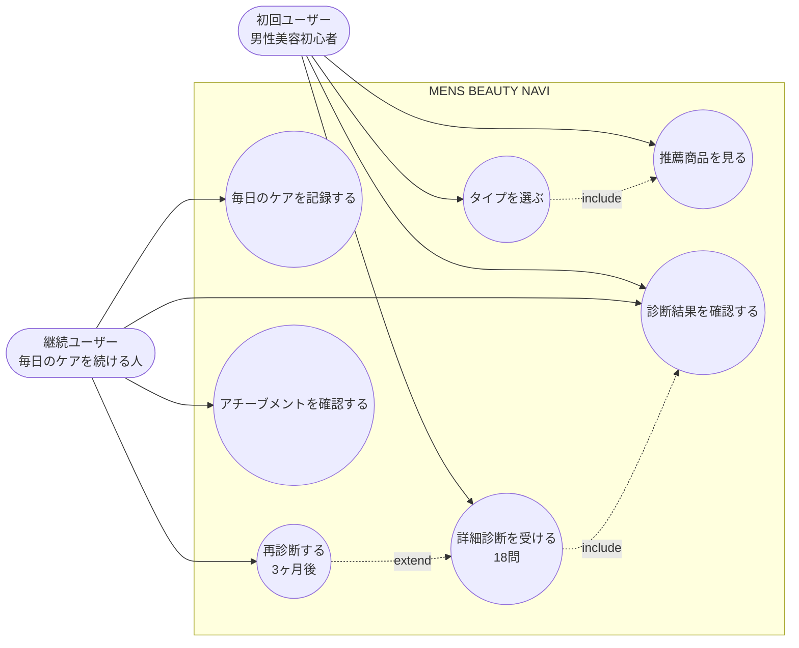

# 01. ユースケース図

「誰が」「このアプリで何ができるか」を一枚で示す図です。

> Mermaid には専用のユースケース記法が無いため、`flowchart` でアクター（角丸長方形）とユースケース（楕円）を表現しています。一般的な UML 表記とは見た目が少し違いますが、内容は同じです。

---

## 図

---

## アクターの説明

| アクター | 役割 |
|---------|------|
| 初回ユーザー | アプリに初めて触れる男性美容初心者。「結局何を買えばいいの？」が出発点 |
| 継続ユーザー | 一度診断を済ませ、毎日のケアを続けている人。記録と再診断が中心 |

## ユースケースの説明

| ID | ユースケース | 概要 |
|----|------------|------|
| UC1 | タイプを選ぶ | トップで6タイプから自分に近いものを選ぶ（ライト導線） |
| UC2 | 推薦商品を見る | 選んだタイプの推薦商品3点を確認する |
| UC3 | 詳細診断を受ける | 18問の質問に答えて自分のタイプを特定する |
| UC4 | 診断結果を確認する | 判定されたタイプ・推薦・ケアルーティンを見る |
| UC5 | 毎日のケアを記録する | ダッシュボードでチェックリストを進める |
| UC6 | 再診断する | 3ヶ月経過後に詳細診断をやり直す |
| UC7 | アチーブメントを確認する | 連続記録・バッジ獲得状況を確認する |

## 補足

- **モックアップではログイン無し**。アクターはあくまで「想定ユーザー像」として図に置いています。
- 実装スコープでは UC1〜UC7 を画面として用意しますが、データ永続化は行いません（再訪してもリセットされる仮実装）。
