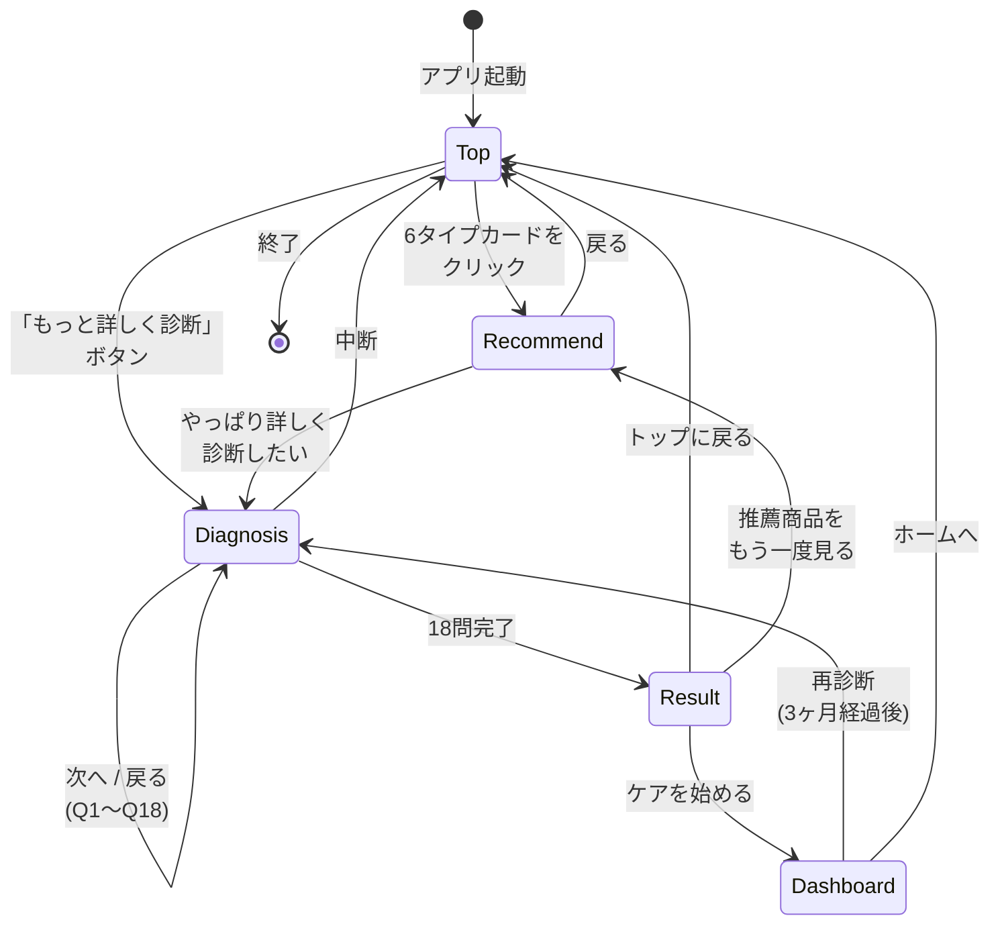

# 02. 画面遷移図

5つの画面がどう繋がっているか、どの操作でどこへ行くのかを示します。

> Mermaid の `stateDiagram-v2` を使用。各状態（state）が **画面**、矢印のラベルが **遷移を起こす操作** に対応します。

---

## 図



---

## 画面と URL

| 画面 | URL | 役割 |
|-----|-----|-----|
| Top | `/` | 6タイプ選択 + 詳細診断 CTA |
| Recommend | `/recommend/[type]` | 選んだタイプの推薦商品3点 |
| Diagnosis | `/diagnosis` | 18問の詳細診断 |
| Result | `/result` | 診断結果・推薦・ケアルーティン |
| Dashboard | `/dashboard` | 毎日のケア記録・連続記録・バッジ |

---

## 動線の解説

### 動線A: ライト導線（直感で選ぶ）

```
Top → Recommend
```
時間がない・とりあえず見たいユーザー向け。タイプカードを直感で選ぶだけで推薦が出る。

### 動線B: 詳細導線（ちゃんと診断）

```
Top → Diagnosis(18問) → Result → Dashboard
```
本気で自分に合うものを知りたいユーザー向け。18問答えると結果＋ルーティン提案＋ダッシュボード入りまで一気通貫。

### 動線C: 継続利用（再診断）

```
Dashboard → Diagnosis(再) → Result
```
3ヶ月後、肌の状態が変わったタイミングで再診断するための導線。

---

## 補足

- モックアップでは **状態の永続化は行わない**ため、ブラウザリロードでダッシュボードの記録はリセットされます。
- 「中断」のような実線でない遷移は、ヘッダーロゴクリックなど**全画面共通の操作**で発生する想定。
