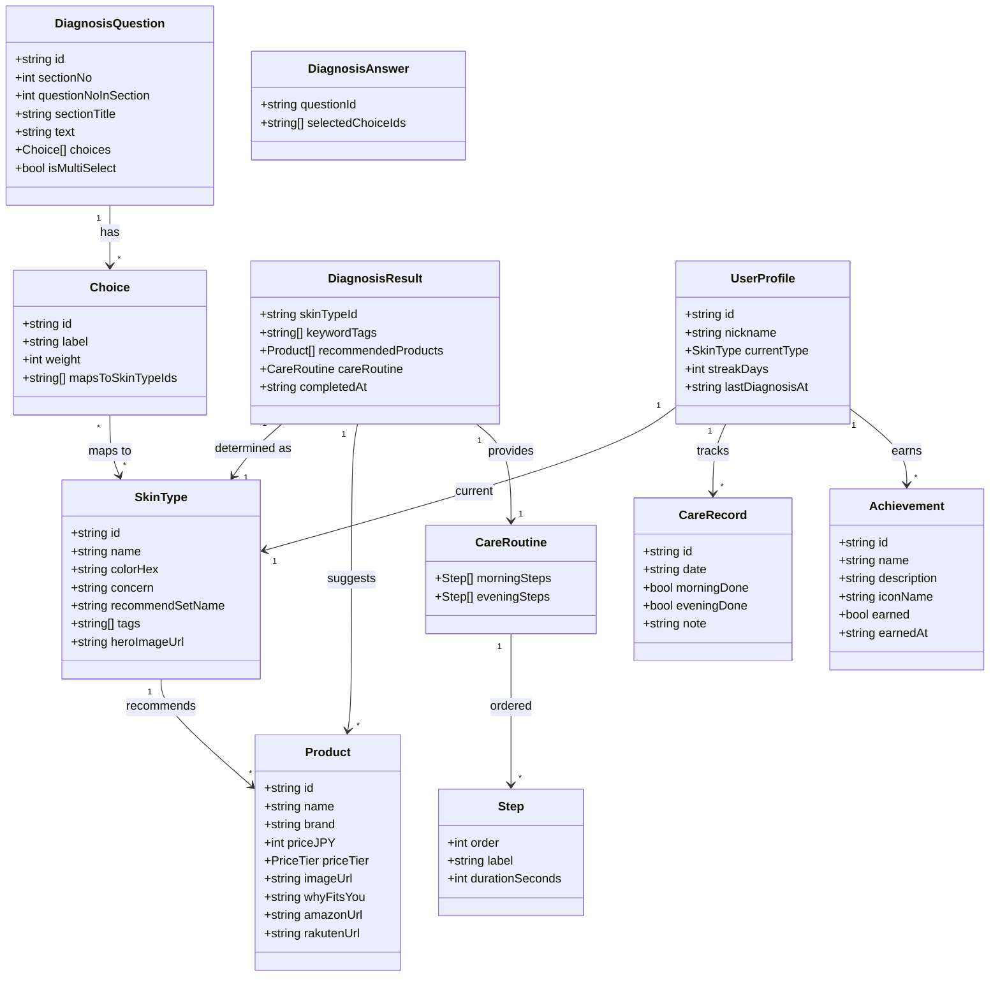

# 03. クラス図（データモデル）

このアプリで扱うデータ（ドメインモデル）の構造を示します。
**`frontend/lib/types.ts` の TypeScript 型はこの図を1対1で写したもの**になる予定です。

> Mermaid の `classDiagram` を使用。フィールド名は実装で使うキャメルケースに合わせています。日付は ISO-8601（例: `2026-04-28`）で持つ想定です。

---

## 図



---

## 各クラスの説明

| クラス | 何を表す？ | 主なフィールド |
|--------|----------|--------------|
| `SkinType` | 6つのタイプ（脂性肌・乾燥肌など） | `id`, `name`, `colorHex`, `tags` |
| `Product` | 推薦商品1点 | `name`, `brand`, `priceJPY`, `whyFitsYou` |
| `DiagnosisQuestion` | 18問のうちの1問 | `sectionNo`, `text`, `choices` |
| `Choice` | 1問の選択肢 | `label`, `mapsToSkinTypeIds`（どのタイプ寄りか） |
| `DiagnosisAnswer` | ユーザーが選んだ答え（1問1つ） | `questionId`, `selectedChoiceIds` |
| `DiagnosisResult` | 18問完了後の判定結果 | `skinTypeId`, `recommendedProducts`, `careRoutine` |
| `CareRoutine` | 朝・夜のケア手順 | `morningSteps`, `eveningSteps` |
| `Step` | ケアルーティンの1ステップ | `order`, `label`, `durationSeconds` |
| `CareRecord` | 1日分のケア実施記録 | `date`, `morningDone`, `eveningDone` |
| `Achievement` | バッジ | `name`, `earned`, `earnedAt` |
| `UserProfile` | ユーザー情報 | `nickname`, `currentType`, `streakDays` |

---

## 列挙型

```typescript
type PriceTier = 'お試し' | '定番' | 'こだわり'
```

---

## モックアップ実装での扱い

- `SkinType` / `DiagnosisQuestion` / `Product` はハードコードの定数として持つ
  （`frontend/lib/constants/skin-types.ts`、`questions.ts` 等）
- `DiagnosisAnswer[]` は React の `useState` でメモリ上に保持
- `CareRecord` / `Achievement` / `UserProfile` はモックデータをハードコード（永続化なし）
- 実プロダクトに移行する際は、`UserProfile` 以下を DB に切り出す想定
