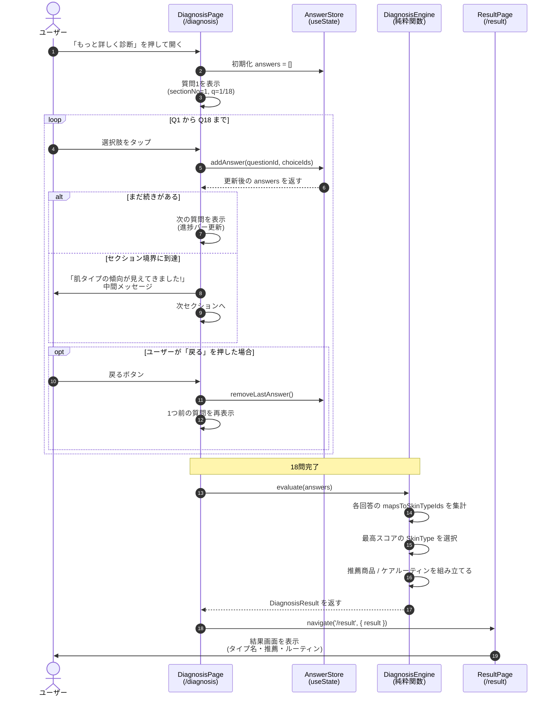

# 04. シーケンス図（18問診断のフロー）

このアプリで一番複雑な機能である **18問の詳細診断**が、内部でどのようにデータをやり取りして結果を出すかを示します。

> Mermaid の `sequenceDiagram` を使用。登場人物は左から「ユーザー」「画面」「状態管理」「判定ロジック」「結果画面」。時系列は上から下へ流れます。

---

## 図

---

## 登場人物の役割

| 名前 | 役割 | 実装上の場所 |
|-----|-----|------------|
| ユーザー | 18問に答える人 | — |
| DiagnosisPage | 質問を出して答えを集める画面 | `frontend/app/diagnosis/page.tsx` |
| AnswerStore | 回答を一時保持する仕組み | `useState<DiagnosisAnswer[]>` |
| DiagnosisEngine | 回答→タイプ判定の純粋関数 | `frontend/lib/diagnosis-engine.ts` |
| ResultPage | 結果を表示する画面 | `frontend/app/result/page.tsx` |

---

## ポイント

- **DiagnosisEngine は純粋関数**（副作用なし）で実装する。これによりユニットテストが書きやすく、未経験メンバーでも安心して触れる。
- **状態管理はあえて React のローカルステートだけ**。Redux や Zustand は仮実装には不要。
- **戻るボタン対応**: `removeLastAnswer()` を呼んで1問戻れるようにする（UX 重要ポイント）。
- **セクション切り替え**: 5セクションの境界で中間メッセージを挟むことでテンポを作る。

---

## エッジケース（仮実装ではどう扱うか）

| ケース | 扱い |
|-------|-----|
| ブラウザリロード | answers が消える。最初からやり直し（仮実装なので OK） |
| 18問以下で離脱 | 結果は出さない。トップに戻すだけ |
| すべての回答が同じタイプを示さない | スコア最大のタイプ1つを選ぶ。同点なら最初に出てきた方 |
| 推薦商品が見つからない | 「準備中」プレースホルダを表示 |
